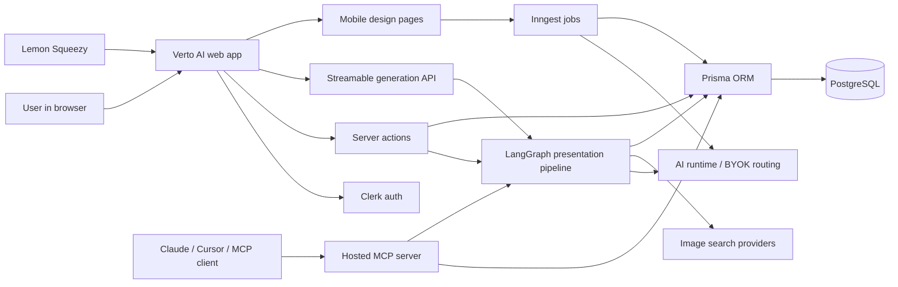
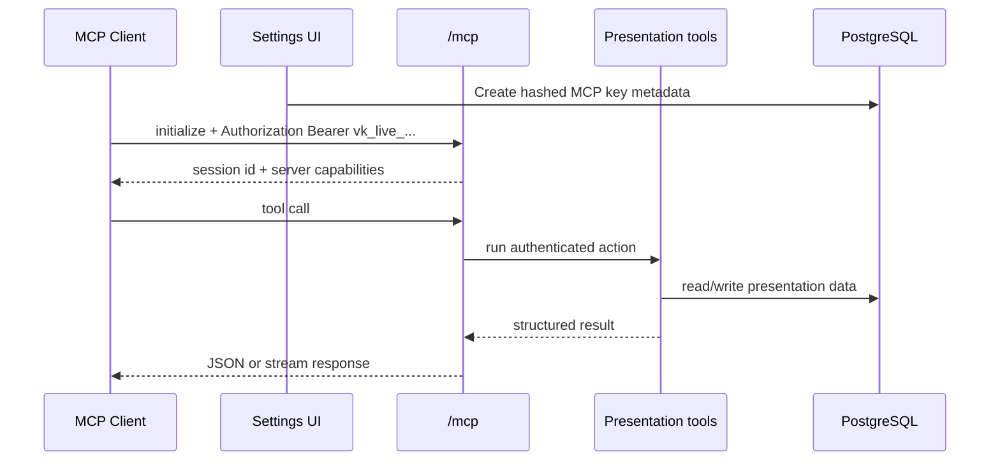
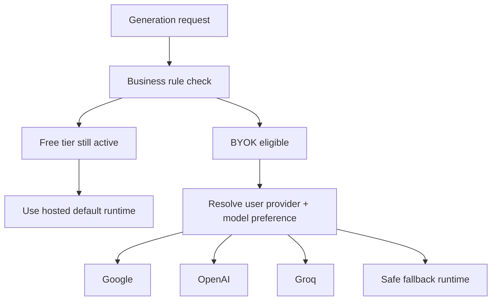

<div align="center">

# Verto AI

### AI-native presentation, design, and MCP workspace

Turn a prompt into a polished presentation, refine it in a visual editor, generate mobile UI concepts, and expose the whole presentation layer through a hosted MCP server.

<p>
  <a href="https://verto.ai.aditya-deokar.me"><strong>Live App</strong></a>
  |
  <a href="https://verto.ai.aditya-deokar.me/docs/mcp/04-usage-guide"><strong>Hosted MCP Guide</strong></a>
  |
  <a href="#architecture"><strong>Architecture</strong></a>
  |
  <a href="#quick-start"><strong>Quick Start</strong></a>
</p>

[](https://nextjs.org)
[](https://www.typescriptlang.org/)
[](https://react.dev/)
[](https://www.prisma.io/)
[](https://langchain-ai.github.io/langgraphjs/)
[](https://modelcontextprotocol.io/)

</div>

---

## Overview

Verto AI is a full-stack creative workspace built on Next.js 16. Its core job is simple: take an idea, turn it into a strong deck fast, and still leave you with enough control to make the result feel authored instead of auto-generated.

What makes the project interesting is that it is not just a slide generator. It combines:

- an 8-step LangGraph presentation pipeline
- a visual slide editor with share and export flows
- a separate mobile design generation subsystem powered by Inngest
- a hosted MCP server that exposes presentation workflows to external AI clients
- a bring-your-own-key runtime with provider and model preferences

## Live Surface

| Surface | URL |
| --- | --- |
| Live app | [https://verto.ai.aditya-deokar.me](https://verto.ai.aditya-deokar.me) |
| Hosted MCP endpoint | [https://verto.ai.aditya-deokar.me/mcp](https://verto.ai.aditya-deokar.me/mcp) |
| MCP discovery URL | [https://verto.ai.aditya-deokar.me/.well-known/oauth-protected-resource](https://verto.ai.aditya-deokar.me/.well-known/oauth-protected-resource) |
| Hosted MCP setup guide | [https://verto.ai.aditya-deokar.me/docs/mcp/04-usage-guide](https://verto.ai.aditya-deokar.me/docs/mcp/04-usage-guide) |

## Why This Project Stands Out

| Area | Why it matters |
| --- | --- |
| Agentic generation | The presentation pipeline is broken into focused agents instead of one giant prompt. Layout happens before content so writing stays structure-aware. |
| Dual creation surfaces | Presentations and mobile designs are separate product lines inside the same app, with different generation strategies and storage models. |
| Hosted MCP | Verto is not only a UI product. It also exposes authenticated presentation tooling over Streamable HTTP for Claude, Cursor, and other MCP clients. |
| BYOK runtime | Users can store their own provider keys, choose preferred models, and let the app route generation through Google, OpenAI, or Groq when business rules allow it. |
| Production-minded SaaS stack | Auth, billing, usage controls, background jobs, sharing, templates, and persistence are all first-class parts of the architecture. |

## Top Features

| Feature | Details |
| --- | --- |
| AI presentation generation | 8-agent LangGraph workflow from topic to final slide JSON |
| Layout-aware content writing | Layout selection happens before writing so output fits the target slide shape |
| Visual slide editor | Recursive content tree, theme switching, and interactive editing |
| Streamable progress | Real-time generation updates backed by persisted run state |
| Mobile design generation | Background HTML screen generation and per-frame regeneration via Inngest |
| Template-aware flows | Published templates, favorites, categories, and AI enhancement paths |
| Public sharing | Publish and unpublish decks with dedicated share routes |
| PDF export | Export polished presentations from the web client |
| Hosted MCP server | 11 presentation tools and 4 resources available through authenticated MCP |
| Multi-provider BYOK | Google, OpenAI, and Groq keys with model preferences and validation metadata |
| Subscription + usage gating | Lemon Squeezy billing, free-tier limits, and business-model-aware access rules |

## Architecture

### 1. System map



### 2. Presentation generation pipeline

```mermaid
flowchart LR
    Prompt["Topic + context + theme"] --> Init["projectInitializer"]
    Init --> Outline["outlineGenerator"]
    Outline --> Layout["layoutSelector"]
    Layout --> Writer["contentWriter"]
    Writer --> Query["imageQueryGenerator"]
    Query --> Fetch["imageFetcher"]
    Fetch --> Compile["jsonCompiler"]
    Compile --> Persist["databasePersister"]
    Persist --> Editor["Editor / share / export"]
```



### 3. MCP request flow



### 4. Runtime routing model



## Core Product Areas

### Presentation workspace

- Topic-to-deck generation with run tracking
- Visual editing, theming, and slide JSON persistence
- Share links, publish state, and export workflows

### Mobile design workspace

- Separate `MOBILE_DESIGN` project type
- AI-generated HTML frames
- Background generation and regeneration through Inngest

### MCP surface

- Hosted Streamable HTTP transport
- Local stdio transport for repo-based workflows
- Presentation lifecycle, editing, publishing, and generation tools

### AI runtime

- Shared resolver for web, streamable generation, MCP, and mobile design
- Preferred provider and model settings
- Validation-aware key storage
- Free-tier-aware BYOK activation

## Current MCP Surface

The hosted MCP server currently exposes:

- 11 presentation-focused tools
- 4 read-only resources
- Streamable HTTP on protocol version `2025-03-26`
- remote Bearer-token auth and local stdio auth

This lets Verto work as both an app and an AI-accessible backend for presentation workflows.

## Tech Stack

| Layer | Technology |
| --- | --- |
| Framework | Next.js 16 App Router |
| Language | TypeScript 5 |
| UI | React 19, Tailwind CSS 4, Radix UI, shadcn/ui |
| State | Zustand |
| AI orchestration | LangGraph |
| AI SDKs | `ai`, `@ai-sdk/google`, `@ai-sdk/openai`, `@ai-sdk/groq` |
| Auth | Clerk |
| Database | PostgreSQL + Prisma |
| Background jobs | Inngest |
| Billing | Lemon Squeezy |
| Export | html2canvas + jsPDF |
| MCP | `@modelcontextprotocol/sdk` |

## Project Map

```text
pptmaker/
|-- prisma/
|   `-- schema.prisma
|-- src/
|   |-- actions/                    # Server actions and business logic
|   |-- agentic-workflow-v2/        # Presentation generation pipeline
|   |-- app/                        # Next.js routes, layouts, API endpoints
|   |-- components/                 # UI, editor, dashboard, landing sections
|   |-- lib/                        # Shared runtime, auth, billing, BYOK utilities
|   |-- mcp/                        # MCP auth, tools, transports, config
|   |-- mobile-design/              # Mobile design subsystem
|   |-- store/                      # Zustand stores
|   `-- generated/prisma/           # Prisma client output
|-- docs/                           # Architecture, API, security, and workflow docs
`-- README.md
```

## Quick Start

### Prerequisites

- Node.js 20+
- Bun
- PostgreSQL database
- Clerk project
- AI provider keys for the flows you want to test

### Local setup

```bash
# Install dependencies
bun install

# Generate Prisma client
npx prisma generate

# Apply local database migrations
npx prisma migrate dev

# Start the app
bun run dev
```

Open [http://localhost:3000](http://localhost:3000).

### Optional local services

```bash
# Inngest development server for mobile design flows
bun run inngest:dev

# Run the MCP server locally over stdio
bun run mcp:dev

# Inspect the local MCP server
bun run mcp:inspect
```

## Useful Scripts

| Script | Command | Purpose |
| --- | --- | --- |
| Dev app | `bun run dev` | Start the Next.js app with Turbopack |
| Inngest dev | `bun run inngest:dev` | Run local background-job development |
| Build | `bun run build` | Create a production build |
| Start | `bun run start` | Start the production server |
| MCP stdio | `bun run mcp:dev` | Launch the local MCP stdio transport |
| MCP inspect | `bun run mcp:inspect` | Open MCP Inspector against the local stdio server |
| Lint | `bun run lint` | Run lint checks |

## Documentation

| Document | Focus |
| --- | --- |
| [docs/01-architecture-overview.md](docs/01-architecture-overview.md) | System context, diagrams, request flows |
| [docs/03-agentic-workflow.md](docs/03-agentic-workflow.md) | Deep dive into the 8-agent generation pipeline |
| [docs/05-api-reference.md](docs/05-api-reference.md) | Server actions, API routes, and backend flows |
| [docs/06-frontend-architecture.md](docs/06-frontend-architecture.md) | Rendering, editor, stores, and route structure |
| [docs/08-deployment-guide.md](docs/08-deployment-guide.md) | Deployment and production considerations |
| [docs/09-security.md](docs/09-security.md) | Auth, authorization, and public-share boundaries |
| [docs/mcp/04-usage-guide.md](docs/mcp/04-usage-guide.md) | Hosted MCP setup and client integration guide |

## Interesting Engineering Notes

- Layout selection happens before content writing so the generated copy can fit the chosen visual structure.
- The MCP server is session-based over Streamable HTTP, so clients must initialize before sending tool calls.
- Mobile design generation intentionally uses background jobs because it produces raw HTML frames and can run longer than normal request lifecycles.
- BYOK is not just a settings form. It is wired through presentation generation, streamable routes, MCP generation, and mobile design jobs.
- The same product supports both direct human workflows in the browser and agent-driven workflows through MCP.

## License

Private repository. All rights reserved.
