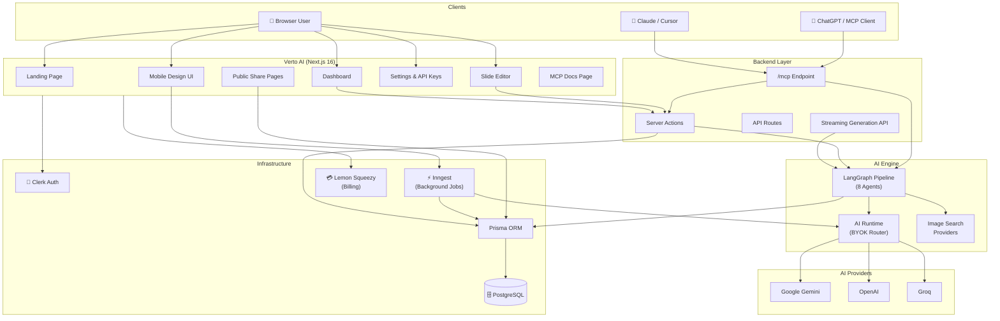
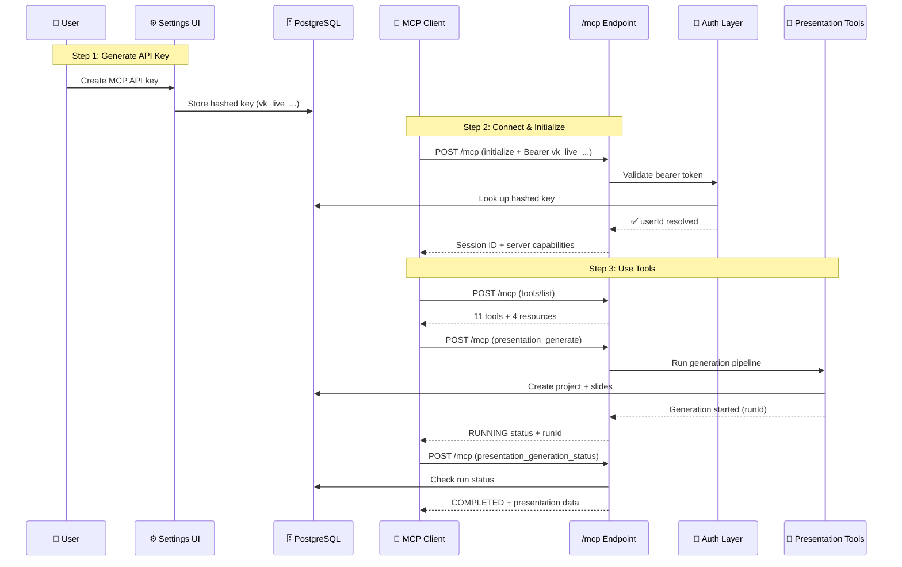
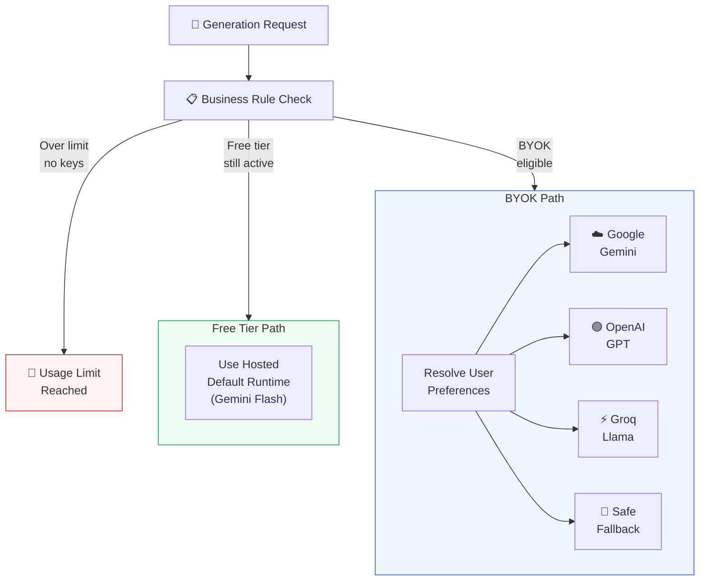
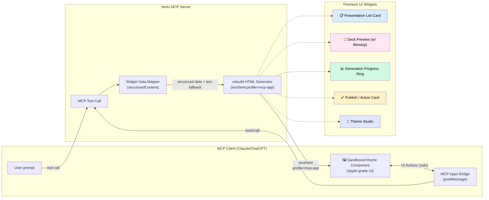
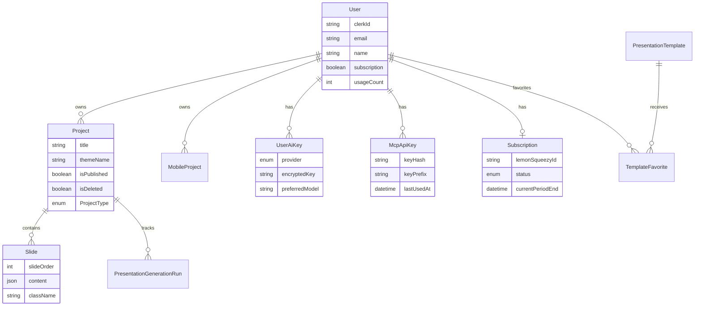
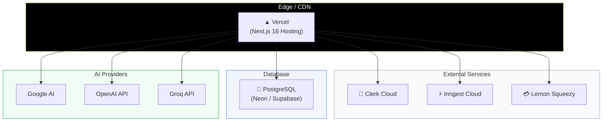

# 🏗️ Verto AI — Architecture Diagrams (Mermaid)

> All diagrams for the YouTube demo video. Copy any of these into slides or render them directly.

---

## 1. Full System Architecture

---

## 2. 8-Agent Generation Pipeline (Detailed)

```mermaid
flowchart LR
    Input["🎯 User Input\n(topic + context + theme)"]

    subgraph Pipeline["LangGraph State Machine"]
        A["1️⃣ Project\nInitializer"]
        B["2️⃣ Outline\nGenerator"]
        C["3️⃣ Layout\nSelector"]
        D["4️⃣ Content\nWriter"]
        E["5️⃣ Image Query\nGenerator"]
        F["6️⃣ Image\nFetcher"]
        G["7️⃣ JSON\nCompiler"]
        H["8️⃣ Database\nPersister"]
    end

    Output["✅ Complete\nPresentation"]

    Input --> A
    A -->|"projectId"| B
    B -->|"outlines[]"| C
    C -->|"layoutType\nper slide"| D
    D -->|"structured content\nper slide"| E
    E -->|"imageQuery\nper slide"| F
    F -->|"imageUrl\nper slide"| G
    F -.->|"🔄 loop if\nmore needed"| F
    G -->|"Slide[] JSON"| H
    H --> Output

    style A fill:#6366f1,color:#fff,stroke:#4f46e5
    style B fill:#7c3aed,color:#fff,stroke:#6d28d9
    style C fill:#9333ea,color:#fff,stroke:#7e22ce
    style D fill:#a855f7,color:#fff,stroke:#9333ea
    style E fill:#c084fc,color:#fff,stroke:#a855f7
    style F fill:#d8b4fe,color:#000,stroke:#c084fc
    style G fill:#e9d5ff,color:#000,stroke:#d8b4fe
    style H fill:#f3e8ff,color:#000,stroke:#e9d5ff
```

---

## 3. MCP Request Flow (Sequence Diagram)

---

## 4. BYOK Runtime Routing

---

## 5. MCP App UI Widget Flow

---

## 6. Data Model Overview

---

## 7. Deployment Architecture

