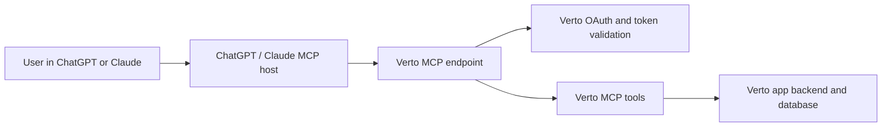
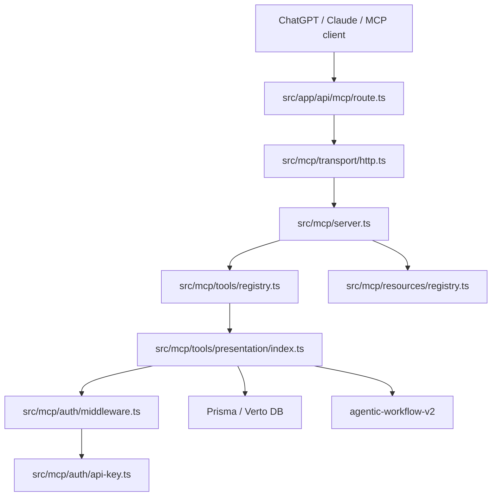
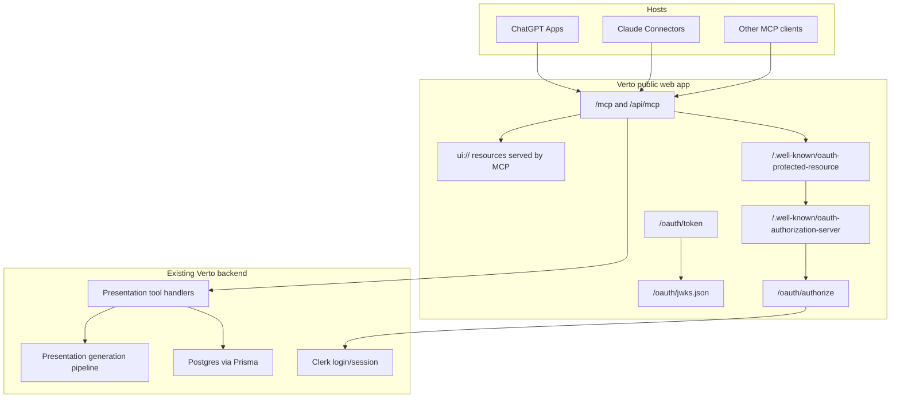

# Technical Implementation Guide

Last updated: 2026-06-14

This guide explains how to move the current Verto MCP server from "works as a custom MCP server" to "ready for ChatGPT Apps and Claude Connectors Directory review."

## 1. Architecture In Simple Terms

Think of the system as five boxes:



The AI assistant does not directly touch the database. It asks the MCP server to run a named tool. The MCP server checks who the user is, validates the input, runs the Verto backend operation, then returns a safe response.

## 2. Current Repo Architecture



Good existing pieces:

- Streamable HTTP transport is already implemented.
- Local stdio transport is already implemented.
- API keys are generated, hashed, revoked, and validated.
- Presentation tool surface already exists.
- Read-only resources already exist.
- Public `/mcp` endpoint is implemented and `/api/mcp` remains available as a legacy endpoint.
- Public well-known protected resource metadata advertises the MCP resource, auth server issuer, bearer header support, scopes, docs URL, and legacy endpoint.
- Presentation tools now include review-grade titles and annotations.

Missing or incomplete pieces for public app distribution:

- OAuth 2.1 authorization flow.
- Authorization server metadata and token endpoints.
- MCP Apps UI resources.
- Submission-grade docs, screenshots, test account, and privacy terms.

## 3. Recommended Target Architecture



## 4. Implementation Phases

### Phase 1: Public Endpoint Cleanup

Goal: make the endpoint look and behave like a production remote MCP server.

Tasks:

1. Add a public `/mcp` route that reuses the current `/api/mcp` handlers.
2. Keep `/api/mcp` working for old clients.
3. Set `NEXT_PUBLIC_APP_URL` to the final production domain.
4. Ensure HTTPS only in production.
5. Verify CORS/origin behavior with ChatGPT and Claude. Server-to-server calls may not send an `Origin` header, but browser-rendered UI will need strict CSP.

Suggested Next.js file:

```text
src/app/mcp/route.ts
```

Implementation idea:

```ts
export {
  POST,
  GET,
  DELETE,
  OPTIONS,
} from "@/app/api/mcp/route";
```

If Next.js route export reuse causes build issues, call the same `handlePost`, `handleGet`, `handleDelete`, and `handleOptions` functions directly.

### Phase 2: Add Tool Annotations

Goal: make tool definitions review-grade for ChatGPT and Claude.

Implementation status:

`src/mcp/tools/presentation/index.ts` now registers tools using `registerTool(...)` with titles and annotations. Keep this metadata aligned with `docs/mcp-apps/05-tool-review-matrix.md`.

Required tool metadata:

- `title`
- `annotations.readOnlyHint`
- `annotations.destructiveHint`
- `annotations.openWorldHint` where supported or useful

Recommended values:

| Tool | `readOnlyHint` | `destructiveHint` | `openWorldHint` |
| --- | --- | --- | --- |
| `presentation_list` | true | false | false |
| `presentation_get` | true | false | false |
| `presentation_create` | false | false | false |
| `presentation_generate` | false | false | true if it calls external AI/image APIs, else false |
| `presentation_update_slides` | false | false | false |
| `presentation_update_theme` | false | false | false |
| `presentation_publish` | false | false | true because it creates an externally reachable share URL |
| `presentation_unpublish` | false | false | false |
| `presentation_delete` | false | false | false |
| `presentation_recover` | false | false | false |
| `presentation_delete_permanently` | false | true | false |

Phase 2 uses the installed SDK's `registerTool(...)` config API instead of the deprecated `server.tool(...)` helper.

### Phase 3: Add OAuth 2.1

Goal: let users click "Connect Verto AI", sign in, consent, and return to ChatGPT/Claude with an access token.

Current state:

- API key auth exists and can stay for local/custom usage.
- `/.well-known/oauth-protected-resource` exists through `src/proxy.ts`.
- Protected resource metadata now advertises the MCP resource, `authorization_servers`, bearer header support, and supported scopes. The full OAuth authorization server flow still belongs to Phase 3.

Minimum OAuth endpoints:

| Endpoint | Purpose |
| --- | --- |
| `/.well-known/oauth-protected-resource` | Tells MCP clients what resource this is and where the authorization server is. |
| `/.well-known/oauth-authorization-server` or `/.well-known/openid-configuration` | Tells clients where authorize/token/JWKS endpoints live. |
| `/oauth/authorize` | User login and consent screen. |
| `/oauth/token` | Exchanges authorization code for access/refresh tokens. |
| `/oauth/jwks.json` | Public signing keys if JWT access tokens are used. |
| `/oauth/revoke` | Optional but recommended token revocation. |

Recommended implementation strategy:

1. Use an established identity provider if possible.
2. Keep Clerk as the Verto login/session provider.
3. Either:
   - verify whether Clerk can act as the OAuth authorization server for this exact MCP flow, or
   - use Auth0, WorkOS, Cognito, Okta, or another IdP as the OAuth server, or
   - implement a small first-party OAuth server that uses Clerk only for the login step.

Token requirements:

- Access tokens are sent as `Authorization: Bearer <token>`.
- Tokens must be audience-bound to the Verto MCP resource.
- Tokens must include or map to Verto user ID.
- Tokens must include scopes.
- Invalid or expired tokens should return HTTP 401 with `WWW-Authenticate`.
- Insufficient scopes should return HTTP 403 with `WWW-Authenticate` and `error="insufficient_scope"`.

Suggested scopes:

```text
presentations:read
presentations:write
presentations:generate
presentations:publish
```

Keep API key auth for:

- `bun run mcp:inspect`
- local stdio clients
- internal developer testing
- custom clients that cannot do OAuth

But for app directory submission, OAuth should be the primary flow.

### Phase 4: Add MCP Apps UI

Goal: make Verto feel like an app inside ChatGPT/Claude, not only a tool API.

Use the MCP Apps standard first:

- Tool metadata points to a UI resource using `_meta.ui.resourceUri`.
- UI resource uses a `ui://...` URI.
- UI runs in a sandboxed iframe.
- UI and host communicate using `ui/*` JSON-RPC over `postMessage`.
- ChatGPT-only capabilities should be feature-detected via `window.openai`.

Recommended first UI resources:

| UI resource | URI | Used by |
| --- | --- | --- |
| Generation progress | `ui://verto/generation-progress.html` | `presentation_generate` |
| Deck preview | `ui://verto/deck-preview.html` | `presentation_get`, completed `presentation_generate` |

Recommended libraries:

| Library | Why |
| --- | --- |
| `@modelcontextprotocol/ext-apps` | Standard helpers for registering app tools/resources. |
| `@modelcontextprotocol/sdk` | Existing MCP server SDK. |
| `vite` | Bundle standalone widget HTML. |
| `vite-plugin-singlefile` | Simplifies sandboxed iframe delivery by bundling CSS/JS into one HTML file. |
| `react` / `react-dom` | Already used in the repo and appropriate for widgets. |
| `zod` | Existing schema validation. |

Suggested folder layout:

```text
src/mcp-apps/
  generation-progress/
    index.html
    app.tsx
  deck-preview/
    index.html
    app.tsx
  shared/
    bridge.ts
    types.ts
```

Suggested build output:

```text
src/mcp/generated-ui/
  generation-progress.html
  deck-preview.html
```

Register resources from the MCP server and serve the generated HTML as app resources.

Security requirements:

- Define exact CSP domains.
- Do not put secrets in widget props or tool results.
- Use temporary file URLs only for the current operation.
- Feature-detect ChatGPT-only APIs.
- Always return text/structured fallback content for hosts that do not support UI.

### Phase 5: Harden Long-Running Generation

Goal: avoid timeouts while still giving users progress.

The current `presentation_generate` tool waits up to `LIMITS.GENERATION_TIMEOUT_MS` (120 seconds). Keep the pattern where the tool can return a `RUNNING` status plus `progress_resource_uri`.

Recommended behavior:

1. Start generation and create a run ID.
2. Wait for a short bounded time.
3. If complete, return presentation ID and preview UI.
4. If still running, return:

```json
{
  "status": "RUNNING",
  "generation_run_id": "run_id",
  "progress_resource_uri": "verto://generation/run_id/progress"
}
```

5. UI widget and follow-up tools can poll or refresh progress.

### Phase 6: Test With Real Hosts

Required validation:

| Test | Tool |
| --- | --- |
| Protocol schema and tool list | MCP Inspector |
| ChatGPT private testing | ChatGPT developer mode connector |
| Claude private testing | Claude custom connector |
| OAuth edge cases | Browser + MCP Inspector |
| Tool behavior | Fully populated test Verto account |
| UI rendering | ChatGPT and Claude conversations |

Test prompts:

```text
List my Verto presentations.
Create a 6 slide deck about AI in education.
Show me the generated deck.
Change the deck theme to a clean startup pitch style.
Publish the deck and give me the share link.
Unpublish that deck.
Soft-delete the test deck.
Recover the test deck.
Permanently delete the test deck only after I confirm.
```

## 5. Environment Variables And Credentials

Existing variables:

| Variable | Purpose |
| --- | --- |
| `DATABASE_URL` | Prisma/Postgres connection. |
| `NEXT_PUBLIC_APP_URL` | Public production base URL. |
| `CLERK_SECRET_KEY` | Existing Clerk server auth. |
| `MCP_ALLOWED_ORIGINS` | Optional CORS allowlist. |
| `MCP_RATE_LIMIT_RPM` | MCP request rate limit. |
| `MCP_RATE_LIMIT_CONCURRENT` | MCP concurrency limit. |
| `MCP_MAX_REQUEST_BYTES` | Request size limit. |
| `MCP_MAX_JSON_DEPTH` | JSON nesting limit. |
| `VERTO_API_KEY` | Local stdio developer auth. |

New recommended variables:

| Variable | Purpose |
| --- | --- |
| `OAUTH_ISSUER` | Public issuer URL: `https://verto.ai.aditya-deokar.me`. |
| `OAUTH_ACCESS_TOKEN_PRIVATE_KEY` | Signing key for JWT access tokens if self-issuing. |
| `OAUTH_REFRESH_TOKEN_SECRET` | Secret or key for refresh token storage/rotation. |
| `OAUTH_AUTH_CODE_SECRET` | Secret for short-lived authorization code signing/storage. |
| `OAUTH_ALLOWED_CLIENTS` | Static/pre-registered clients if not using DCR/CIMD. |
| `MCP_PUBLIC_ENDPOINT` | Canonical MCP resource URL: `https://verto.ai.aditya-deokar.me/mcp`. |

Do not commit these values. Store production values in the deployment platform secret manager.

## 6. Data Model Additions For OAuth

The existing `McpApiKey` model is useful for API keys, but OAuth needs different storage.

Suggested models:

```prisma
model OAuthAuthorizationCode {
  id          String   @id @default(cuid())
  codeHash    String   @unique
  userId      String   @db.Uuid
  clientId    String
  redirectUri String
  scopes      String[]
  resource    String
  expiresAt   DateTime
  usedAt      DateTime?
  createdAt   DateTime @default(now())

  user User @relation(fields: [userId], references: [id], onDelete: Cascade)
}

model OAuthRefreshToken {
  id          String   @id @default(cuid())
  tokenHash   String   @unique
  userId      String   @db.Uuid
  clientId    String
  scopes      String[]
  resource    String
  expiresAt   DateTime
  revokedAt   DateTime?
  createdAt   DateTime @default(now())
  rotatedAt   DateTime?

  user User @relation(fields: [userId], references: [id], onDelete: Cascade)
}
```

If using an external IdP, you may not need these exact models. You still need a reliable mapping from OAuth token subject to Verto user.

## 7. Review-Grade Tool Behavior

Every tool should pass these checks:

- Tool name is short and clear.
- Tool description says what it does, not how the model should behave.
- Reads and writes are separate tools.
- Destructive operations are isolated.
- Valid input succeeds.
- Invalid input returns a useful error.
- Tool never leaks another user's data.
- Tool never dumps too much data by default.
- Tool does not collect conversation data beyond what is needed.
- Tool logs enough for debugging without storing secrets.

## 8. Compatibility Strategy

Build for the portable standard first:

- `_meta.ui.resourceUri`
- `ui://` resources
- `ui/*` bridge
- `tools/call`
- text and structured fallback output

Then add optional ChatGPT extensions only when they improve UX:

- `window.openai.requestDisplayMode`
- `window.openai.openExternal`
- `window.openai.uploadFile` or file APIs, if future deck import/export needs them

Claude-specific logic should be minimal. Use Claude `clientInfo` only for telemetry, not authorization.

## 9. Implementation Order

1. Add `/mcp` alias.
2. Add tool titles and annotations.
3. Add structured outputs where missing.
4. Implement OAuth metadata and token validation.
5. Add the OAuth authorization/consent flow.
6. Add generation progress UI resource.
7. Add deck preview UI resource.
8. Test with MCP Inspector.
9. Test with ChatGPT developer mode.
10. Test with Claude custom connector.
11. Prepare submission assets.
12. Submit to OpenAI.
13. Submit to Anthropic.

## 10. References

- OpenAI MCP guide: https://developers.openai.com/api/docs/mcp
- OpenAI Apps SDK MCP server docs: https://developers.openai.com/apps-sdk/concepts/mcp-server
- OpenAI ChatGPT UI docs: https://developers.openai.com/apps-sdk/build/chatgpt-ui
- OpenAI authentication docs: https://developers.openai.com/apps-sdk/build/auth
- MCP authorization spec: https://modelcontextprotocol.io/specification/2025-11-25/basic/authorization
- MCP Apps overview: https://modelcontextprotocol.io/extensions/apps/overview
- MCP Apps build guide: https://modelcontextprotocol.io/extensions/apps/build
- Claude connector building docs: https://claude.com/docs/connectors/building
- Claude connector testing docs: https://claude.com/docs/connectors/building/testing
