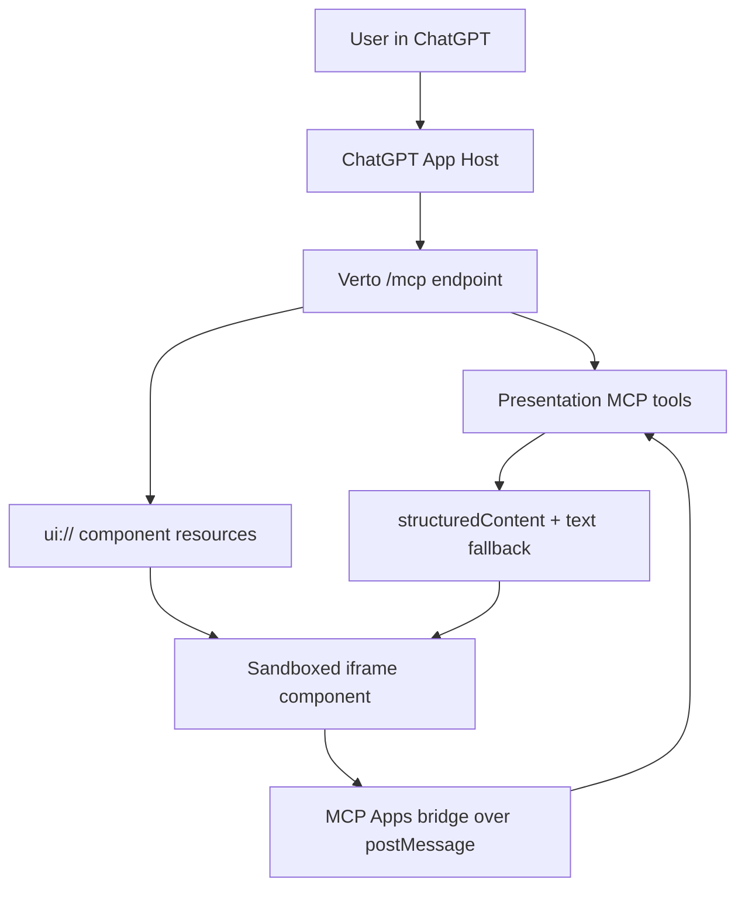

# Phase 9: Premium MCP Apps UI Implementation Plan

Last updated: 2026-06-18

Status: Phases 9A, 9B, 9C, 9D, 9E, 9F, and 9H implemented on 2026-06-18. Phase 9G remains a planning item until reviewed.

## Goal In Plain English

Make Verto AI feel like a real app inside ChatGPT, not just a tool that returns JSON.

The end user should be able to ask ChatGPT to generate, inspect, update, and publish a presentation, then see a polished Verto UI directly in the chat: progress, deck preview, slide thumbnails, theme details, and clear next actions.

The target quality is "Apple-grade" in the practical product sense:

- quiet, premium, and fast
- visually rich without feeling noisy
- obvious primary actions
- beautiful empty, loading, error, and success states
- accessible on mobile and desktop
- consistent with ChatGPT's own UI rules

## Original Repo Diagnosis Before Phase 9A

The original app UI work was a good start, but it was closer to a static HTML proof of concept than a production ChatGPT Apps UI.

Current files:

- `src/mcp/apps/constants.ts`
- `src/mcp/apps/widgets.ts`
- `src/mcp/resources/app-ui.ts`
- `src/mcp/tools/presentation/index.ts`
- `src/mcp/tools/_shared/response.ts`

What existed before Phase 9A:

- `presentation_get` points to `ui://verto/deck-preview.html`.
- `presentation_generate` and `presentation_generation_status` point to `ui://verto/generation-progress.html`.
- The tool descriptor includes both `_meta.ui.resourceUri` and `_meta["openai/outputTemplate"]`.
- Two UI resources are registered and return static HTML strings.
- Tool responses return JSON inside `content[0].text`.

Why ChatGPT probably was not showing the UI before Phase 9A:

1. Resource content metadata was not on the returned resource content.
   OpenAI's current Apps SDK reference says component resource `_meta` belongs on the resource contents. The code put metadata in the resource registration options, but the returned `contents[0]` objects only included `uri`, `mimeType`, and `text`.

2. Resource MIME type was too generic.
   The code returned `mimeType: "text/html"`. OpenAI's current ChatGPT UI example uses `text/html;profile=mcp-app` for MCP App component templates.

3. Tool results did not include `structuredContent`.
   ChatGPT's widget examples render from `toolResult.structuredContent`. The shared `mcpSuccess(...)` helper serialized the payload only into a text block. That was good as fallback, but not enough for a reliable visual widget.

4. The widgets were not reading the MCP Apps bridge lifecycle.
   The widgets waited for custom postMessage data and `window.__VERTO_MCP_PAYLOAD__`. ChatGPT sends tool lifecycle data using MCP Apps bridge notifications like `ui/notifications/tool-result`.

5. The UI is still attached directly to data tools.
   This can work, but OpenAI recommends a cleaner pattern where data tools return structured data and a dedicated render tool decides when to show the widget. For Verto, we should keep the direct attachment for the first compatibility fix, then move toward render tools for premium UX.

6. Submission-grade component domain and CSP were not complete.
   CSP metadata had empty domains and no dedicated widget domain. For app submission, OpenAI documents `_meta.ui.domain` / `_meta["openai/widgetDomain"]` as required for a dedicated hosted component origin.

Phase 9A fixed items 1, 2, 3, 4, and the initial widget-domain/CSP metadata for item 6. The dedicated production widget subdomain can still be improved before final app submission.

## Research Sources

Primary sources used for this plan:

- OpenAI Apps SDK UI guide: https://developers.openai.com/apps-sdk/build/chatgpt-ui
- OpenAI Apps SDK reference: https://developers.openai.com/apps-sdk/reference
- OpenAI Apps SDK UI guidelines: https://developers.openai.com/apps-sdk/concepts/ui-guidelines
- OpenAI Connect from ChatGPT: https://developers.openai.com/apps-sdk/deploy/connect-chatgpt
- MCP Apps Extension announcement: https://blog.modelcontextprotocol.io/posts/2025-11-21-mcp-apps/

Key technical points from the current OpenAI docs:

- ChatGPT sends widget data using JSON-RPC over `postMessage`.
- Tool results should include `structuredContent` for UI rendering.
- Rendered component resources should include resource-content `_meta`.
- New apps should prefer the MCP Apps bridge and can still use `window.openai` for ChatGPT-specific enhancements.
- Premium UI should respect ChatGPT's visual guidelines: system colors, restrained brand accents, consistent spacing, no distracting custom gradients, and no duplicated ChatGPT controls.

## Recommended End-State User Experience

### Generate A Deck

User prompt:

```text
Create a 10 slide investor pitch deck for my AI tutoring startup.
```

ChatGPT calls Verto. The user sees an inline Verto generation card:

- topic and deck intent
- progress ring or compact progress bar
- stage timeline: outline, research, slides, design, export
- live status copy
- generated slide count when available
- primary action when done: Open deck
- secondary action when done: Publish share link

### Preview A Deck

User prompt:

```text
Show me my latest Verto deck.
```

The user sees a premium deck preview:

- cover slide preview
- 3 to 6 slide filmstrip thumbnails
- title, theme, slide count, last updated
- status badges: Draft, Published, Shared
- primary action: Open in Verto
- secondary action: Publish or Copy link

### Iterate On A Deck

User prompt:

```text
Make this deck more minimal and executive.
```

The user sees a compact update card:

- before/after theme summary
- changed slide count
- lightweight visual comparison
- action to inspect the updated deck

### Publish A Deck

User prompt:

```text
Publish this and give me a share link.
```

The user sees a share card:

- public link state
- copy/open action
- unpublish action only after explicit user intent
- clear visibility note

## Recommended Architecture

Use the existing MCP server and add a dedicated MCP Apps UI layer.



Proposed source layout:

```text
src/mcp/apps/
  constants.ts
  widget-data.ts
  widgets.ts
  components/
    shared/
      runtime.ts
    generation-progress.ts
    deck-preview.ts
  generated/
    generation-progress.html
    generation-progress.ts
    deck-preview.html
    deck-preview.ts
    presentation-list.html
    presentation-list.ts
    action-result.html
    action-result.ts
    index.ts
```

Recommended libraries for this project:

- Phase 9C uses vanilla TypeScript and `esbuild` for very small single-file iframe bundles.
- React 19, React DOM, and `lucide-react` remain available for later premium widgets if bundle size stays under budget.
- Use scoped CSS inside each widget bundle, not Tailwind runtime inside the iframe.
- Avoid Framer Motion in v1 unless bundle size remains small. Use CSS transitions and `prefers-reduced-motion`.
- Do not add Vite yet. Use esbuild because the repo already has a large Next app build.

## Design Direction

The Verto ChatGPT UI should feel premium by being restrained and precise.

Visual rules:

- Use ChatGPT/system text colors by default.
- Use Verto brand color only for accents, badges, and primary actions.
- Use real deck content as the main visual signal, not decorative backgrounds.
- Use 8px or smaller radii unless the ChatGPT container makes a different radius feel native.
- Keep every inline card scannable in 10 seconds.
- Limit primary actions to one or two.
- No nested scrolling inside inline cards.
- No big marketing hero sections inside ChatGPT.
- No decorative gradients or background blobs.
- Provide excellent loading, empty, error, permission, and partial-data states.

UI surfaces:

1. Generation Progress
   Compact status card with progress, stage timeline, estimated state, and final deck action.

2. Deck Preview
   Cover preview, slide filmstrip, metadata, and publish/open actions.

3. Theme Studio
   Theme swatches and before/after preview for theme changes. This can ship after preview/progress.

4. Publish Card
   Share link status, copy/open action, and unpublish state.

5. Error Recovery
   Helpful retry state when generation fails, auth expires, or a deck is missing.

## Phase Plan

### Phase 9A: Make The Current UI Render In ChatGPT

Goal: fix compatibility before visual redesign.

Implementation status: complete as of 2026-06-18.

Tasks:

- Add a shared MCP app MIME constant: `text/html;profile=mcp-app`.
- Move resource `_meta` onto each returned `contents[0]`.
- Include both standard MCP Apps metadata and OpenAI compatibility aliases:
  - `_meta.ui.prefersBorder`
  - `_meta.ui.csp.connectDomains`
  - `_meta.ui.csp.resourceDomains`
  - `_meta.ui.domain`
  - `_meta["openai/widgetDescription"]`
  - `_meta["openai/widgetPrefersBorder"]`
  - `_meta["openai/widgetCSP"]`
  - `_meta["openai/widgetDomain"]`
- Update tool metadata to include:
  - `_meta.ui.resourceUri`
  - `_meta.ui.visibility`
  - `_meta["openai/outputTemplate"]`
  - optional `_meta["openai/toolInvocation/invoking"]`
  - optional `_meta["openai/toolInvocation/invoked"]`
- Add `structuredContent` to `McpToolResponse`.
- Update `mcpSuccess(...)` to preserve current text fallback while also returning `structuredContent`.
- Update the two existing widgets to listen for `ui/notifications/tool-result`.
- Keep `window.openai` support as optional compatibility, not the primary data path.

Acceptance criteria:

- `presentation_get` renders a visible deck preview card in ChatGPT.
- `presentation_generation_status` renders a visible progress card in ChatGPT.
- If a host does not support UI, the JSON text fallback remains useful.
- Browser console has no CSP or sandbox errors.
- MCP Inspector can read both `ui://` resources.

### Phase 9B: Create Strong Widget Data Contracts

Goal: define exactly what each widget receives, so the UI can be polished without guessing.

Implementation status: complete as of 2026-06-18.

Tasks:

- Add TypeScript types for widget payloads:
  - `DeckPreviewWidgetData`
  - `GenerationProgressWidgetData`
  - `PublishCardWidgetData`
  - `ThemeStudioWidgetData`
- Add server-side mappers from existing project/generation data to widget data.
- Keep widget payloads small and safe:
  - no access tokens
  - no private Clerk data
  - no raw full slide JSON unless required
  - no hidden prompts
- Add output schemas to UI-enabled tools where practical.
- Add unit checks that `structuredContent` matches the widget data contract.

Recommended data shape example:

```ts
type DeckPreviewWidgetData = {
  widget: "deck_preview";
  presentation: {
    id: string;
    title: string;
    themeName: string | null;
    slideCount: number;
    updatedAt: string;
    isPublished: boolean;
    shareUrl?: string;
  };
  slides: Array<{
    id: string;
    title: string;
    order: number;
    previewText: string;
    visualHint?: string;
  }>;
  actions: {
    canOpen: boolean;
    canPublish: boolean;
    canUnpublish: boolean;
  };
};
```

### Phase 9C: Add A Real Component Build Pipeline

Goal: stop hand-writing large static HTML strings and build maintainable premium components.

Implementation status: complete as of 2026-06-18.

Tasks:

- Add `esbuild` as a dev dependency.
- Add scripts:
  - `mcp:apps:build`
  - `mcp:apps:check`
  - include `mcp:apps:check` in Phase 7 checks after stable
- Build each widget into a single inline HTML string.
- Store generated HTML under `src/mcp/apps/generated/`.
- Keep generated files deterministic and reviewable.
- Keep bundle sizes small and fail the check if a widget grows too large.

Recommended first budget:

- generation progress widget: under 120 KB uncompressed
- deck preview widget: under 180 KB uncompressed
- publish card widget: under 100 KB uncompressed

### Phase 9D: Build Premium Deck Preview V1

Goal: make the most important visual surface excellent.

Implementation status: complete as of 2026-06-18.

Tasks:

- Render cover slide preview from available slide data.
- Render a 3 to 6 item slide filmstrip.
- Add theme, slide count, updated time, and publish status badges.
- Add primary CTA: Open in Verto.
- Add secondary CTA: Publish or Copy link, depending on state.
- Add skeleton loading and partial-data state.
- Add mobile layout where filmstrip becomes a compact row.

Acceptance criteria:

- The user can understand the deck quality without opening Verto.
- The card looks polished in dark mode and light mode.
- Long titles do not overflow.
- Slide previews keep fixed aspect ratios.

### Phase 9E: Build Premium Generation Progress V1

Goal: make long-running generation feel trustworthy and alive.

Implementation status: complete as of 2026-06-18.

Tasks:

- Show generation topic and current state.
- Show a progress ring or compact progress bar.
- Show stage timeline:
  - queued
  - outline
  - content
  - design
  - finalizing
  - complete
- Show failure state with retry guidance.
- Add final deck preview link when complete.
- Use subtle animation only when `prefers-reduced-motion` allows it.

Acceptance criteria:

- User understands that generation is running.
- User knows whether to wait, ask for status, or open the completed deck.
- The UI does not flicker or jump as status changes.

### Phase 9F: Add UI-Initiated Actions Carefully

Goal: allow buttons inside the widget to call safe tools.

Implementation status: complete as of 2026-06-18.

Tasks:

- Use MCP Apps bridge `tools/call` for actions.
- Mark UI-callable tools with `_meta.ui.visibility` where needed.
- Keep destructive actions gated by explicit user intent.
- Start with safe actions:
  - refresh generation status
  - open external Verto page
  - publish deck after explicit button click
  - copy/open share URL
- Do not expose broad update/delete actions in the first UI release.

Acceptance criteria:

- Buttons work in ChatGPT without requiring a new prompt.
- ChatGPT still asks for approval where required.
- Audit logging continues to record tool calls.

### Phase 9G: Add Render Tools For Cleaner Model Behavior

Goal: make ChatGPT choose visual rendering intentionally.

Tasks:

- Add render-only tools:
  - `presentation_render_preview`
  - `presentation_render_generation_progress`
  - `presentation_render_publish_card`
- Data tools return structured data without forcing a widget every time.
- Render tools include the output template metadata.
- Keep direct templates on `presentation_get` and `presentation_generation_status` until render tools are proven in ChatGPT.

Acceptance criteria:

- ChatGPT renders UI when it helps the user.
- ChatGPT can still use data-only calls for reasoning and follow-up edits.
- UI does not appear repeatedly in noisy conversations.

### Phase 9H: Visual QA, Accessibility, And Submission Evidence

Goal: make the UI review-ready.

Implementation status: complete as of 2026-06-18.

Tasks:

- Test in ChatGPT developer mode.
- Capture screenshots for:
  - presentation list
  - generation running
  - generation complete
   - deck preview
   - publish success
   - action result success and warning states
   - error state
   - mobile/narrow layout
- Validate:
  - keyboard navigation
  - screen reader labels
  - color contrast
  - reduced motion
  - no clipped text
  - no nested scrolling
  - no console errors
- Add these screenshots to `docs/mcp-apps/submission-assets/`.
- Update the Phase 8 submission packet with final UI screenshots.

Acceptance criteria:

- UI passes manual review checklist.
- UI looks professional in both light and dark ChatGPT themes.
- Submission packet includes current UI evidence.

## Implementation Order I Recommend

Start with the smallest path to visible UI:

1. Phase 9A: compatibility fix.
2. Phase 9B: widget data contracts.
3. Phase 9C: component build pipeline.
4. Phase 9D: premium deck preview.
5. Phase 9E: premium generation progress.
6. Phase 9F: safe UI actions.
7. Phase 9G: render tools.
8. Phase 9H: visual QA and submission evidence.

Do not start with visuals first. If the metadata and bridge are wrong, ChatGPT will still show nothing no matter how beautiful the widget is.

## First Implementation Checklist After Approval

When you approve Phase 9A, implement only this first:

- Update resource MIME and resource-content metadata.
- Add `structuredContent` support to MCP responses.
- Add widget payload mappers for `presentation_get` and `presentation_generation_status`.
- Update current static widgets to read `ui/notifications/tool-result`.
- Add focused tests for resource metadata and structuredContent.
- Deploy and verify in ChatGPT developer mode.

Expected result after this first implementation:

- The UI appears in ChatGPT.
- It may not be "Apple-grade" yet.
- It proves the entire visual rendering path is working before we invest in polish.

## Decisions

Recommended defaults:

| Decision | Recommendation | Why |
| --- | --- | --- |
| Component build system | Vanilla TypeScript + esbuild for Phase 9C | Keeps iframe bundles around 6 KB; React can be introduced later if premium UI still stays under budget. |
| Styling | Scoped CSS inside each widget bundle | Simple, predictable, and avoids pulling the full app styling runtime into ChatGPT. |
| Icons | `lucide-react` | Already installed and visually consistent with ChatGPT style. |
| Animation | CSS transitions first | Lower bundle size and easier reduced-motion support. |
| Widget domain | Use a dedicated widget origin before submission | Better isolation and aligns with OpenAI submission expectations. |
| Bridge API | MCP Apps bridge first, `window.openai` optional | More portable across ChatGPT and future MCP Apps hosts. |
| Data strategy | Text fallback plus `structuredContent` | Works for UI and non-UI hosts. |
| Render pattern | Direct template first, render tools second | Fastest path to visible UI, then cleaner model behavior. |

## Risks And Mitigations

| Risk | Impact | Mitigation |
| --- | --- | --- |
| ChatGPT still does not render after metadata fixes | Blocks visual work | Test with a tiny "hello" widget resource first, then re-add Verto data. |
| Widget bundle gets too large | Slow rendering or review concern | Add size budgets and keep dependencies lean. |
| Slide thumbnails are not visually rich enough | Preview feels less premium | Start with CSS/HTML approximations, then add generated thumbnail images later if needed. |
| UI actions trigger unsafe operations | Review rejection or user trust issue | Only expose safe actions first and keep server-side authorization checks. |
| Different hosts support different UI metadata | Claude/ChatGPT divergence | Keep text fallback and use standard MCP Apps keys first, compatibility aliases second. |

## Definition Of Done For Premium UI

Verto MCP Apps UI is done when:

- ChatGPT renders Verto UI cards reliably from `/mcp`.
- Deck previews look premium and use actual presentation content.
- Generation progress is clear and trustworthy.
- Publish/share flow is visible and controlled.
- The UI has strong empty, loading, error, and success states.
- The same tools still work as text-only MCP tools.
- Reviewer screenshots are captured and added to the submission packet.
- No secrets or private auth data are ever sent to the iframe.
- The UI passes desktop, mobile, dark mode, light mode, and reduced-motion checks.
