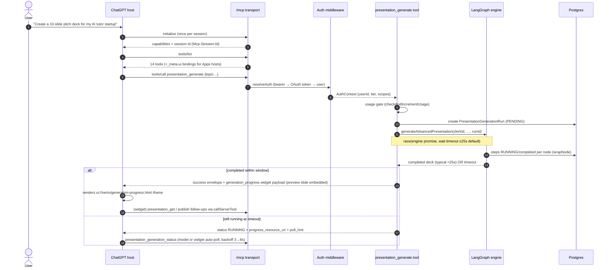

# 01 — System Architecture

> Part of the [architecture deep dive](./README.md). Covers the component
> inventory, layering rules, and one full request lifecycle end-to-end.

---

## 1. The deployment reality

One Next.js 16 deployable serves four concerns that most companies split:

1. **Marketing + dashboard web app** (React 19, App Router)
2. **MCP server** (`/mcp`, `/api/mcp`, `/mcp/health` routes + `src/mcp/**`)
3. **OAuth authorization server** (`/oauth/*` + `/.well-known/*` rewrites via `src/proxy.ts`)
4. **Widget resource server** (the `ui://` resources are just route-served strings from `src/mcp/apps/generated/*`)

A single Postgres database behind Prisma holds users, projects, slides (JSON),
generation runs, BYOK keys, and all MCP OAuth tables. There is no separate
worker for presentations — generation runs inside the request (see
[05](./05-generation-pipeline.md) and [09](./09-scaling-limits-roadmap.md)).

**Why single-deployable is right *for now*:** the whole product is
request-scoped CRUD plus one long-running operation; a second service would
add deploy coupling and auth-sharing complexity before any scale need exists.
The cost is that every stateful in-process optimization (session Map, SSE
emitter) becomes a scaling debt item — tracked honestly in [09](./09-scaling-limits-roadmap.md).

## 2. Layering rules (enforced by convention + phase7 pins)

```
┌────────────────────────────────────────────────────────────┐
│ SURFACES      app/(protected)/**   app/api/**  app/oauth/**│  Clerk session │ MCP AuthContext
├────────────────────────────────────────────────────────────┤
│ TRANSPORT     src/mcp/transport/{http,stdio}.ts            │  protocol only, no business logic
├────────────────────────────────────────────────────────────┤
│ MCP DOMAIN    src/mcp/tools/**  src/mcp/resources/**       │  zod, scopes, ownership calls
│               src/mcp/apps/** (contracts + widget sources) │
├────────────────────────────────────────────────────────────┤
│ CORE          src/core/projects/ownership.ts               │  transport-neutral,
│               src/core/generation/{steps,runs}.ts          │  NO clerk, NO mcp imports
├────────────────────────────────────────────────────────────┤
│ ENGINE        src/agentic-workflow-v2/**                   │  LangGraph, emits SSE + DB writes
├────────────────────────────────────────────────────────────┤
│ SHARED CLIENT src/lib/slides/render-core (+SlideCanvas)    │  one renderer, two consumers
├────────────────────────────────────────────────────────────┤
│ DATA          prisma/schema.prisma → src/generated/prisma  │
└────────────────────────────────────────────────────────────┘
```

Dependencies point **downward only**. The two rules that matter:

- `core/**` may not import Clerk or MCP types → any surface can call it
  (this killed the actions↔mcp twin implementations).
- `lib/slides/render-core` may not import React or MCP → both the esbuild
  widget bundles and the dashboard bundle it unchanged.

## 3. Component inventory (what to name-drop in an interview)

| Area | Files | Notes |
|---|---|---|
| HTTP transport | `src/mcp/transport/http.ts` (~570 ln) | Session Map (:39), origin allowlist (:52-73), CORS (:75), auth guard (:160), body caps + JSON depth guard (:286-341), GET capability banner (:477+) |
| stdio transport | `src/mcp/transport/stdio.ts` | Local dev via `npm run mcp:dev`; env API key auth |
| OAuth server | `src/mcp/auth/oauth-{clients,tokens,config,metadata,users}.ts` + `/oauth/*` routes | PKCE S256-only, hashed opaque tokens, atomic code exchange, refresh rotation, DCR+CIMD |
| API keys | `src/mcp/auth/api-key.ts`, `actions/mcp-keys.ts` | bcrypt hashes, 12-char prefix index lookup, `vk_live_…` |
| Tools | `src/mcp/tools/presentation/*.ts` (14) + `_shared/{errors,pagination,response}.ts` | One registration helper, typed error factories, cursor pagination |
| Resources | `src/mcp/resources/{app-ui,presentations,templates,themes,generation-progress}.ts` | 7 UI resources + 4 data resources/templates |
| Widget contracts | `src/mcp/apps/widget-data.ts` (~662 ln) | v2 discriminated union, pure factories, boundary caps |
| Widgets | `src/mcp/apps/components/*.ts` + shared kernel | See [11-immersive](../11-immersive-widgets-architecture.md) §5 |
| Render kernel | `src/lib/slides/render-core/{index,color}.ts` + `SlideCanvas.tsx` + `themes.ts` | Shared by widget bundles AND dashboard preview surfaces |
| Core services | `src/core/**` | Ownership check, run lifecycle, step normalization |
| Engine | `src/agentic-workflow-v2/**` | 8-node LangGraph, `wrapNode` instrumentation, SSE emitter |
| Progress | `hooks/useAgenticGenerationV2.ts` + `useStreamingGeneration.ts` + `/api/generation/stream` | SSE-first with authenticated ownership check, polling fallback |
| QA gates | `scripts/mcp-apps/*` | build+budgets, 360 static pins, focused tsc, Puppeteer harness |

## 4. End-to-end lifecycle: "Make me a pitch deck" in ChatGPT



Three things worth calling out:

1. **The tool returns twice-shaped results**: `structuredContent` for Apps
   hosts, a JSON text block for everything else — one handler, two audiences.
2. **Timeout ≠ failure.** Long generations degrade to RUNNING + poll hints;
   the model is explicitly told not to start duplicates.
3. **Widgets join the flow without new auth surface**: their
   `callServerTool` rides the same transport/session/auth as model calls.

## 5. What lives where in the repo (orientation map)

```
src/
├── mcp/                      ← the MCP product surface
│   ├── transport/  auth/  security/  middleware/
│   ├── tools/presentation/   ← 14 handlers + schemas + mappers
│   ├── resources/            ← ui:// HTML + data resources
│   └── apps/                 ← contracts + widget sources + generated artifacts
├── core/                     ← transport-neutral services (Phase D3)
├── lib/
│   ├── slides/render-core/   ← canonical ContentItem→HTML (Phase D1)
│   ├── streaming/EventEmitter.ts  ← in-process SSE bus
│   └── ai-provider.ts        ← BYOK resolution shared by UI+MCP
├── agentic-workflow-v2/      ← the engine
├── actions/                  ← Clerk-session server actions (thin over core)
├── hooks/                    ← dashboard progress/stream clients
└── app/
    ├── mcp/, api/mcp/, api/generation/stream/, oauth/, .well-known→proxy.ts
    └── (protected)/          ← dashboard editor, create flows, share viewer
scripts/mcp-apps/             ← build + phase7 pins + focused tsc + Puppeteer QA
```

## 6. Failure-domain map

| Fails | Blast radius | Mitigation today | Real fix (Phase C) |
|---|---|---|---|
| Postgres down | Everything read/write fails | typed INTERNAL_ERROR envelopes; health endpoint reports DB reachability | managed HA instance |
| LLM provider down / rate-limited | Generation fails mid-graph | run marked FAILED w/ step id; retry = new run; BYOK lets user switch provider | queue + provider fallbacks ([09](./09-scaling-limits-roadmap.md)) |
| Server restart | MCP sessions lost (host reconnects); SSE streams drop (client falls back to polling); rate-limit buckets reset | hosts handle re-init; fallback poll keeps UX alive | externalize state ([09](./09-scaling-limits-roadmap.md)) |
| Widget bundle rejected by host | Single widget unusable | budgets + Puppeteer matrix catch pre-release | n/a (artifact problem) |
| Bad merge breaks contracts | Silent until runtime | 360 static pins + freshness checks + focused typecheck gate it | CI workflow (Phase B1) |

Continue to [02 — Transport & sessions](./02-transport-and-sessions.md).
