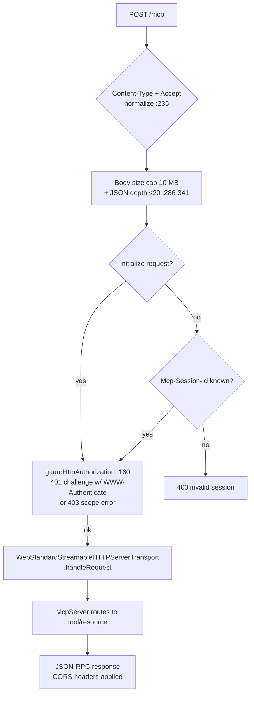
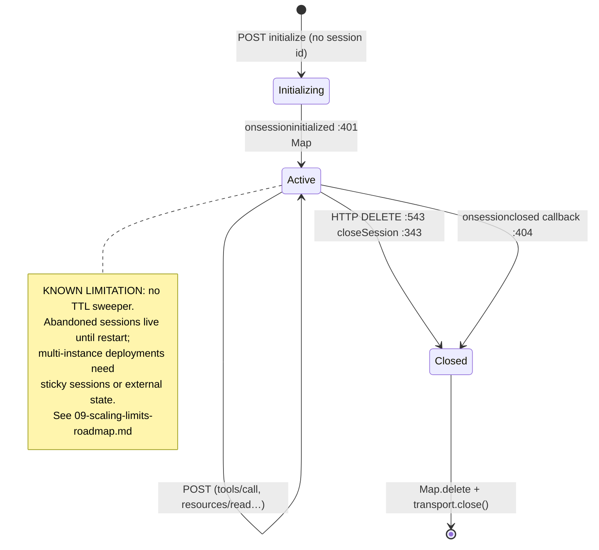

# 02 — Transport & Session Lifecycle

> Part of the [architecture deep dive](./README.md). How JSON-RPC actually
> moves: Streamable HTTP mechanics, the session store, hardening layers, and
> why stdio still exists.

---

## 1. Two transports, one server factory

`src/mcp/transport/http.ts` and `stdio.ts` both build their `McpServer` via
`createServerInstance()` (http.ts:41) — same tool/resource registrations,
different plumbing. This is what makes "works in Claude's directory" and
"works locally in MCP Inspector" the same code path.

| | Streamable HTTP (`/mcp`) | stdio |
|---|---|---|
| Audience | ChatGPT, Claude, VS Code, basic-host | local dev, Inspector, scripts |
| Auth | OAuth 2.1 bearer → API key → Clerk cookie | `VERTO_API_KEY` env |
| Sessions | `Mcp-Session-Id` header + Map | process lifetime |
| Primary URL | `https://…/mcp` (legacy `/api/mcp` kept) | n/a |

## 2. Request routing shape

Next.js route handlers are 5-line adapters:

```
src/app/mcp/route.ts        ─┐
src/app/api/mcp/route.ts     ├─→ handlePost / handleGet / handleDelete / handleOptions
src/app/mcp/health/route.ts ─┘    (transport/http.ts exports)
```

Keeping protocol logic out of route files means the transport is testable
in-memory — the migration branch proved this with a 12-tool smoke test over
`InMemoryTransport`.

## 3. POST lifecycle (the main path)



Hardening details worth citing precisely:

- **Origin allowlist** (`getAllowedOrigins`, :52): env-driven; supports `*`
  for development. DNS-rebinding protection per MCP spec.
- **Two body caps**: Content-Length pre-check *and* buffered-size check —
  because chunked requests can lie about headers.
- **JSON depth guard** (:219): recursive depth ≤ `MCP_MAX_JSON_DEPTH` (20)
  defeats stack-smash parsers.
- **Accept normalization** (:235): hosts that forget
  `application/json, text/event-stream` get corrected rather than rejected.
- **`Cache-Control: no-store`, `X-Content-Type-Options: nosniff`** on every
  response.

## 4. Session state machine



Failed-initialize cleanup is handled: if the transport never surfaces a
session id, the server instance is closed eagerly rather than leaking.

## 5. GET — not SSE-first, but useful

Per Streamable HTTP, GET may open a server-initiated stream. Verto instead
serves a **self-describing capability banner** (:477+) when no session id is
present: protocol version, primary vs legacy URL, rate-limit tiers, output
limits, health endpoint. Rationale: we have no server-push events to deliver
(widget progress is poll-based by design — [08 §ADR-8](./08-decisions-and-tradeoffs.md)),
and a banner turns curl/debugging into documentation. GET *with* a valid
session delegates to the transport for spec compliance.

## 6. The auth guard seam

`guardHttpAuthorization(request, body)` (:160) runs **before** the SDK sees
the message, using the parsed body only to extract the tool name for
scope checks. It distinguishes:

| Situation | Response |
|---|---|
| No credentials on protected resource | 401 + `WWW-Authenticate` pointing at `/.well-known/oauth-protected-resource` (RFC 9728-style challenge) |
| Valid token, missing scope | 403 JSON-RPC `-32005` with required scope named |
| Unknown/expired token | 401 `-32004` |

The double-resolution tradeoff: auth resolves here **and** again inside each
tool callback (for the `AuthContext` the handler needs). Cost = one extra
Prisma user lookup per call; benefit = handlers stay transport-agnostic and
identical over stdio. Phase C7 collapses this into one pass-through.

## 7. Health & observability surface

- `/mcp/health` + `/api/mcp/health`: DB ping + coarse status (used by prod monitors).
- Audit log (`middleware/audit-logger.ts`): structured JSON to stderr per
  invocation — trace id, tool, user, latency, sizes, policy flags
  (`operation/destructive/createsPublicUrl`), redaction of secret-shaped keys
  and truncation of arrays (5 samples / 20 keys).
- Generation telemetry (`mcp/lib/generation-telemetry.ts`): start/complete/
  fail/timeout-as-running events; topic text redacted.

stderr-only logging is honest about its ceiling: retention/aggregation
depends on the platform. It was chosen over adding a logging vendor dep for
launch; swap point is single-file.

## 8. Why keep stdio at all?

Three concrete reasons: (1) MCP Inspector runs against it — the fastest dev
loop for tool changes; (2) CI smoke tests exercise tools without network
plumbing; (3) it proves the handler layer is transport-pure, which is exactly
the property that later let Phase D3 extract `core/`. If stdio died, nothing
user-facing breaks; if it *weren't* there, layering discipline would rot
first.

Continue to [03 — Auth & security](./03-auth-security.md).
