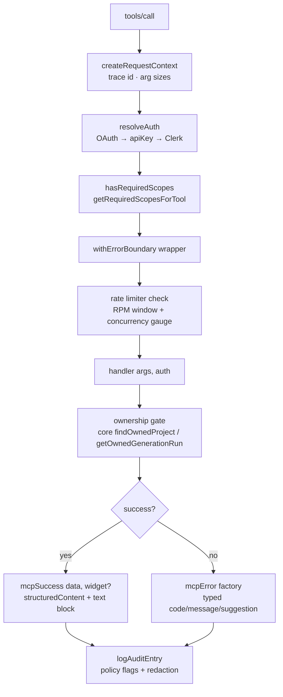

# 04 — Tool Pipeline

> Part of the [architecture deep dive](./README.md). From registration to
> response envelope: how all 14 tools are declared, guarded, executed, and
> shaped.

---

## 1. Registration anatomy

One helper registers everything (`tools/presentation/index.ts:250+`):

```ts
registerAppTool(server, TOOL_NAMES.X, {
  title, description,
  inputSchema: { …zod shape… },        // duplicated in schemas.ts (drift-guarded by pins)
  outputSchema: MCP_SUCCESS_OUTPUT_SCHEMA,
  annotations: { readOnlyHint, destructiveHint, idempotentHint… },
  _meta: createToolUiMeta(uiResourceUri?, { appCallable?, appOnly? }),
}, callback)
```

`createToolUiMeta` (`apps/constants.ts`) emits **only spec keys** — the legacy
OpenAI dialect was deleted in the ext-apps migration:

```jsonc
"_meta": { "ui": { "resourceUri": "ui://verto/deck-preview.html",
                   "visibility": ["model", "app"] } }
```

## 2. The full matrix (memorize this table)

| Tool | Scope | readOnly | destructive | UI resource | Visibility | Why |
|---|---|---|---|---|---|---|
| presentation_list | read | ✅ | – | presentation-list.html | model+app | widget renders workspace |
| presentation_get | read | ✅ | – | deck-preview.html | model+app | preview + guided edit host |
| presentation_render_deck | read | ✅ | – | deck-live.html | **app-only** | view swap; never enters model context |
| presentation_render_theme_studio | read | ✅ | – | theme-studio.html | **app-only** | same |
| presentation_create | write | – | – | action-result.html | model-only | broad mutation stays with model |
| presentation_delete | write | – | – | action-result.html | model-only | soft delete, idempotent |
| presentation_recover | write | – | – | action-result.html | model-only | idempotent |
| presentation_delete_permanently | write | – | **✅** | action-result.html | model-only | `confirm: z.literal(true)`, ≤20 ids |
| presentation_update_slides | write | – | – | action-result.html | model+app | the one broad write widgets may call; editor mediates |
| presentation_update_theme | write | – | – | theme-studio.html | model+app | apply loop stays in-widget |
| presentation_publish | publish | – | – | publish-card.html | model+app | celebration card |
| presentation_unpublish | publish | – | – | action-result.html | model+app | confirm-guarded in-widget |
| presentation_generate | generate | – | – | generation-progress.html | model-only | long-running; returns RUNNING |
| presentation_generation_status | generate | ✅ | – | generation-progress.html | model+app | poll target for widget + model |

Visibility semantics are the interaction model: `['model']` = LLM-driven;
`['model','app']` = user's own click may invoke through the authenticated
pipeline (zero model latency/tokens); `['app']` = invisible to the model.

## 3. Per-call pipeline



Note what's *not* here: no per-tool auth code. Handlers receive an
`AuthContext` and never touch credentials; that's why stdio/HTTP/OAuth/API-key
all share handlers unchanged.

## 4. Response envelope & error taxonomy

Success (`_shared/response.ts`):

```jsonc
{
  "structuredContent": { "success": true, "data": {...}, "widget": { /* v2 contract */ } },
  "content": [{ "type": "text", "text": "{…same JSON…" }]   // non-Apps clients
}
```

Errors are factories, not ad-hoc strings (`_shared/errors.ts`):
`unauthorized / forbidden / insufficientScope / notFound / validationError /
rateLimited / usageLimitExceeded / generationFailed / internal` — each carries
a machine `code`, human message, and an **LLM-facing suggestion** ("call
presentation_generation_status instead of starting a duplicate"). The outer
boundary converts unexpected throws into sanitized INTERNAL_ERROR so stack
traces never reach models.

## 5. Cross-cutting handler patterns

- **Ownership everywhere**: every project-addressing tool starts with
  `findOwnedProject(id, userId, {includeDeleted})` (Phase D3 moved this to
  core); run tools use `getOwnedGenerationRun`. Not-found and not-yours are
  deliberately indistinguishable.
- **Idempotency posture**: delete/recover/publish/unpublish are naturally
  idempotent and say so in responses (advisory notes drive warning-status
  widgets). `presentation_create` logs a `request_id` but dedup is deferred
  ("Phase 4" comment at create.ts:32) — honest gap.
- **Pagination**: only list paginates — base64url cursor `{id,v}` decode-
  validated, page clamp 1..50, `take: n+1` peek for `has_more`, parallel count.
- **Output caps**: mappers cap slides (40) and bytes (200 KB), attach
  truncation metadata instead of failing.
- **Long-running pattern**: generate races engine-vs-timeout, then returns
  RUNNING + `progress_resource_uri` + explicit anti-duplicate hints
  ([05](./05-generation-pipeline.md)).

## 6. Resources vs tools division

| Kind | URIs | Auth | Purpose |
|---|---|---|---|
| UI resources | `ui://verto/*.html` ×7 | host session | widget HTML + `_meta.ui` CSP/permissions |
| Data resource template | `verto://generation/{runId}/progress` | ownership-checked | same status payload as the status tool (resource-flavored access) |
| Catalog resources | `verto://themes`, `verto://templates` | public/by-design | theme catalog, published templates (≤50) |
| Placeholder | `verto://presentations` | guidance JSON | points agents at `presentation_list` (resources lack per-request auth context) |

The placeholder is a teachable point: MCP resources have no per-call auth
context, so anything user-scoped must be a tool — hence the stub.

## 7. Schema duplication risk, pinned shut

Input schemas exist twice (inline registration + `schemas.ts`) for SDK typing
reasons. They *will* drift if edited carelessly — which is exactly why the
phase7 pin suite asserts both blocks stay coherent per tool. Deleting the
duplication awaits an upstream SDK type improvement; until then the tripwire
is deliberate.

Continue to [05 — Generation pipeline](./05-generation-pipeline.md).
