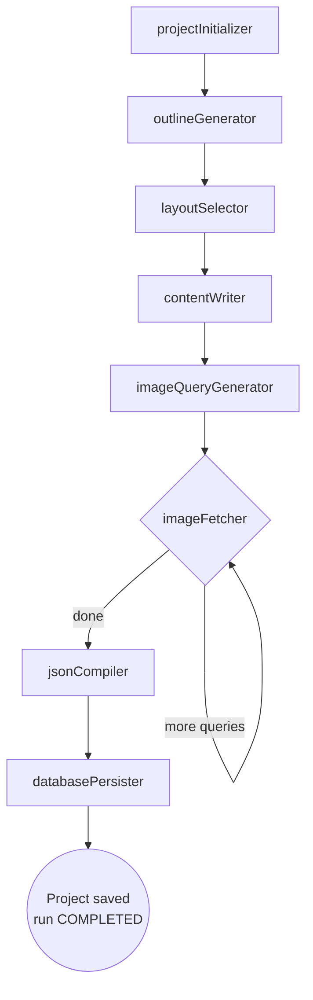
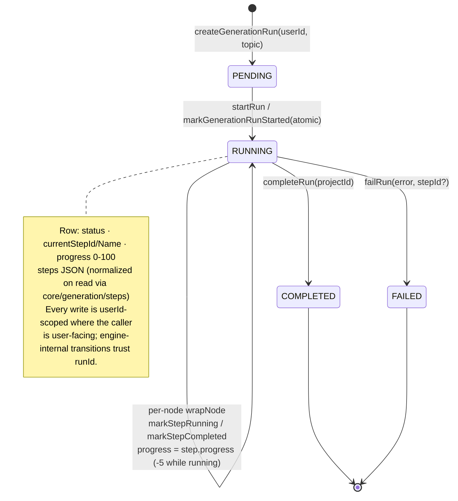
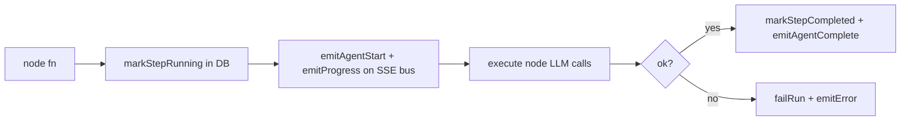
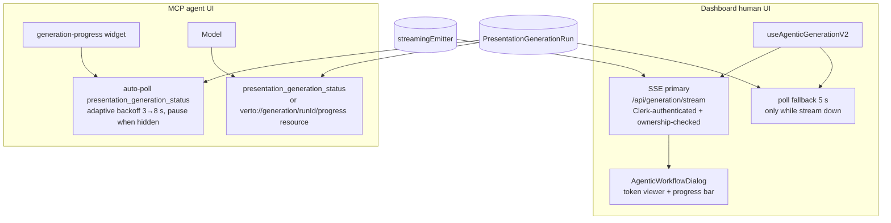

# 05 — Generation Pipeline

> Part of the [architecture deep dive](./README.md). The LangGraph v2 engine,
> run lifecycle, instrumentation, and how each surface learns about progress.

---

## 1. One engine, every surface

Dashboard create-flows (Agentic Workflow, Theme Picker re-generation,
Templates) and the MCP `presentation_generate` tool call the **same**
`generateAdvancedPresentation()` (`agentic-workflow-v2/index.ts`). One engine
means one behavior surface to test and one set of prompts to tune.

## 2. Graph topology



Deliberate ordering: **layout before content** (layoutSelector picks slide
skeletons first so contentWriter fills constrained shapes — comment at
advanced-genai-graph.ts:153). Models are resolved per-user through BYOK
(`lib/ai-provider.ts`): encrypted user keys win, platform defaults fall back.
Recursion is capped (≤150 steps) — a runaway loop fails the run instead of
the request.

## 3. Run state machine (DB-backed)



`steps` JSON merges onto canonical definitions at read time
(`normalizeSteps`) so stale/unknown step ids from older versions can never
leak into payloads.

## 4. Instrumentation: `wrapNode` does three jobs

Every node executes inside one wrapper (advanced-genai-graph.ts:64-116):



This triple-write (DB + SSE + telemetry) is why both surfaces stay consistent
without talking to each other.

## 5. Progress delivery per surface (post-D2 shape)



Why the two surfaces differ (a favorite interview probe):

- **Widgets poll because hosts are heterogeneous.** SSE/server-push into
  sandboxed iframes is not universally supported; HTTP polling with backoff +
  hidden-tab pause works everywhere and is trivially testable. Server stays
  stateless per call.
- **The dashboard streams because we own both ends.** Post-D2 the SSE route is
  authoritative (hydration snapshot built from the DB row, seq-based resume),
  and polling exists only as degradation — one channel doing one job instead
  of two channels racing.

SSE fan-out itself is an **in-process emitter** — correct for one instance,
the first thing that breaks at scale ([09](./09-scaling-limits-roadmap.md)).

## 6. The timeout dance (MCP-specific)

`presentation_generate` waits up to 25 s by default (max 120):

```mermaid
sequenceDiagram
    participant Model
    participant Tool as presentation_generate
    participant Engine
    Model->>Tool: call (wait_timeout ≤120 s)
    Tool->>Engine: race(enginePromise, timer)
    alt engine finishes first
        Engine-->>Tool: deck + projectId
        Tool-->>Model: success + generation_progress widget (preview embedded)
    else timer wins
        Tool-->>Model: {status: RUNNING, generation_run_id,<br/>progress_resource_uri, poll_hint}
        Note over Model: hint says: check status;<br/>do NOT start another generate
    end
```

This converts "long operation" from an error into a protocol feature — models
handle explicit RUNNING states far better than hangs.

## 7. Failure semantics

| Point of failure | Behavior |
|---|---|
| Node throws | `failRun(error, nodeId)` → run FAILED with failing step named; tool returns `generationFailed` with suggestion |
| Recursion cap hit | same path as throw |
| Usage limit exceeded | pre-flight gate → `usageLimitExceeded` (shared meter with dashboard) |
| Timeout reached, still running | RUNNING payload (above); engine continues server-side |
| Duplicate generate while running | rate limiter concurrency gauge + status tool hints steer to polling |

## 8. What would change under a queue (preview of Phase C)

Move `generateAdvancedPresentation` invocation behind Inngest (already used by
mobile-design): tool enqueues + returns RUNNING immediately; worker performs
identical DB/SSE writes; nothing in tools/widgets/dashboard changes except the
wait window collapses. The seams are already cut exactly there.

Continue to [06 — Widget system](./06-widget-system.md).
