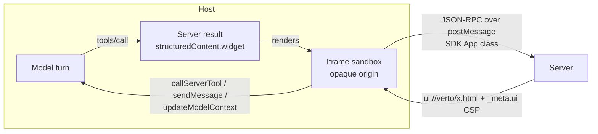
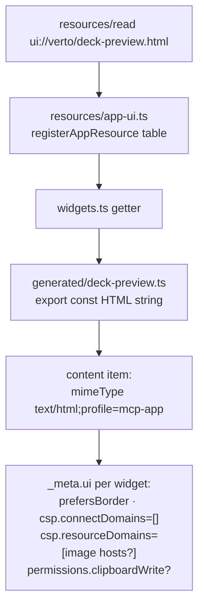
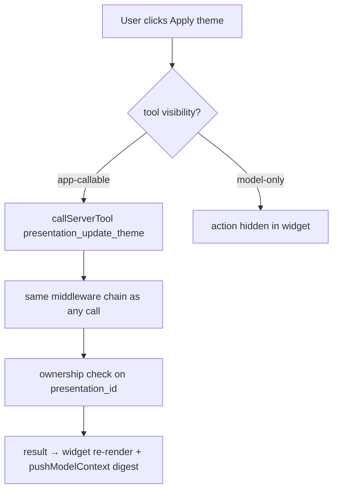

# 06 — Widget System (MCP Apps UI)

> Part of the [architecture deep dive](./README.md). The server-side widget
> architecture: the MCP Apps model, resource serving, visibility classes, and
> CSP. For client internals (skin engine, renderer, editor, QR), read
> [`11-immersive-widgets-architecture.md`](../11-immersive-widgets-architecture.md)
> — this file deliberately does not repeat it.

---

## 1. The MCP Apps model in 60 seconds

MCP Apps = tools + HTML resources bound together:



The tool declares `_meta.ui.resourceUri`; an Apps-capable host fetches that
`ui://` resource, sandbox-iframes it, replays the tool result into it via
`ontoolresult`, and lets the iframe call back through the same MCP session.
Non-Apps hosts just see normal tool results (the text block) — graceful by
construction.

## 2. Serving path for `ui://verto/*.html`



Design points:

- **Single-file HTML** (esbuild IIFE inline): zero external origins → empty
  `connectDomains` is valid, which is the most secure posture the spec allows.
- **Image domains allowlisted only where slides render** (deck-preview,
  deck-live, generation-progress previews). List/action widgets get none.
- **`clipboardWrite` permission scoped to publish-card only** — least privilege
  per surface.
- **Optional pinned origin** via `MCP_APP_WIDGET_DOMAIN`; otherwise hosts
  assign opaque origins (why widgets never touch localStorage).

## 3. The seven widgets ↔ tools map

| Widget | Bound tool(s) | Visibility | Distinctive capability |
|---|---|---|---|
| presentation-list | list | model+app | workspace rows, refresh, pagination |
| deck-preview | get | model+app | Present/Change-theme CTAs (drive app-only tools), guided slide editor |
| generation-progress | generate, generation_status | generate scope | auto-poll engine w/ backoff, run timeline, completion preview |
| theme-studio | render_theme_studio (app-only), update_theme | mixed | catalog browser; apply loop in-widget; model-context push |
| deck-live | render_deck (app-only) | app-only | fullscreen presenter, keyboard nav, grid overview |
| publish-card | publish | model+app | confetti, clipboard copy, in-widget QR, unpublish loop |
| action-result | create/delete/recover/delete_permanently/update_slides/unpublish | model(+app for unpublish) | shared generic outcome card |

Two app-only "view" tools exist because navigation must not consume model
turns or hallucinate parameters — the host swaps surfaces directly.

## 4. Widget boot contract (why order matters)

```
injectStyles(skin)                 ← paint instantly, no FOUC
attachHostAdaptation(app)          ← BEFORE connect: context burst can't be missed
app.ontoolresult = render          ← BEFORE connect: first result can't be missed
app.connect()                      ← SDK handshake (ui/initialize)
refreshHostAdaptation()
optional QA hook __VERTO_MCP_PAYLOAD__
```

This ordering invariant is enforced by a phase7 pin, not by convention —
someone re-ordering boot steps fails CI with an explanation.

## 5. How widgets act (and how that stays secure)

Widget → server actions go through `callMcpTool(name,args)` =
SDK `callServerTool` (15 s timeout) over the **same session/auth** as model
calls. Security therefore reduces to the visibility classes plus handler-side
ownership:



Model-context pushes (`theme_applied`, `presentation_unpublished`,
`slides_edited`, `generation_completed`) are capability-gated and
digest-deduplicated so follow-up turns stay grounded without spamming.

## 6. Build & budget system (CI-shaped)

- `gen-themes.mjs`: dashboard themes → `themes-data.ts` (freshness-checked;
  one source of truth for both UIs).
- `build-widgets.mjs`: esbuild IIFE → single HTML + TS string module per
  widget; **hard byte budgets** (384 KB standard; 416 generation-progress;
  448 deck-preview; 512 deck-live). `--check` mode makes artifacts hermetic:
  source change without rebuild fails phase7.
- Why budgets exist at all: every widget re-ships the SDK (~305 KB baseline).
  Budgets turned "bundle creep" from a review-time opinion into a red/green
  gate.

## 7. Degradation matrix

Every host API is capability-guarded:

| Capability absent | Fallback |
|---|---|
| `updateModelContext` | silent no-op |
| `openLinks` | `window.open` |
| `sendLog` | console.warn |
| `requestDisplayMode` (fullscreen) | inline stage presenter |
| `sendMessage` (follow-ups) | user-visible "host hasn't enabled this yet" error |
| clipboard write | share URL shown as text |

This is why the same bundle ships to ChatGPT today and Claude/VS Code without
per-host forks — the matrix is the portability story.

Continue to [07 — Shared kernel & data layer](./07-shared-kernel-data-layer.md).
