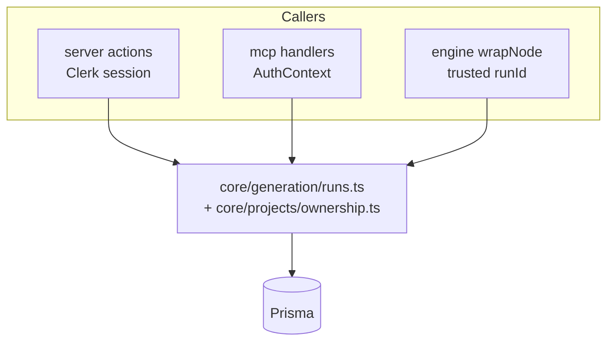
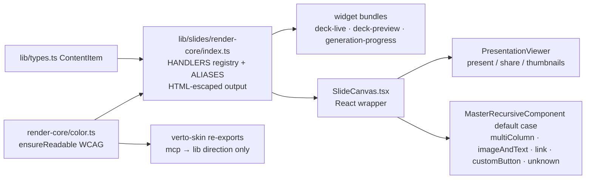
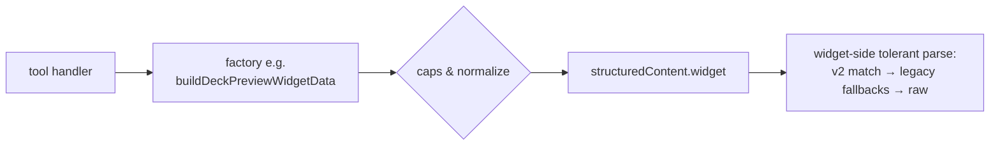

# 07 — Shared Kernel & Data Layer

> Part of the [architecture deep dive](./README.md). The pieces both UIs are
> made of: `core/` services, the slide-render kernel, payload contracts,
> mappers/normalizers, and the Prisma model map.

---

## 1. Why a `core/` layer exists (Phase D3)

Before D3, thin business rules lived twice — once in Clerk-coupled server
actions, once in MCP libs:

| Rule | actions twin | mcp twin | Resolution |
|---|---|---|---|
| Step normalization | `normalizeSteps` | `normalizeGenerationSteps` | byte-identical → moved to `core/generation/steps.ts` |
| Project ownership | `getOwnedProject` (auth inside) | `getOwnedProjectForMcp` (userId param) | query identical → `core/projects/ownership.ts`; actions keep envelope wrapper |
| Run lifecycle | find→update pairs | atomic `updateMany({userId})` | core adopts the **atomic** pattern; engine transitions stay runId-trusted |



Layer rule: **core imports no Clerk and no MCP types** — enforced by review +
a phase7-style grep pin. Result: adding a third surface (CLI, mobile) means
writing an auth adapter, not duplicating logic.

## 2. The render kernel (Phase D1) — one renderer, two worlds



Facts worth stating precisely:

- Coverage = every `ContentType` member + aliases (`text`, `quote`,
  `bulletedList`, `code`, `comparisonTable`, `pricingTable`, `multiColumn`) —
  asserted by a phase7 gate that parses `types.ts` and checks the registry.
- Before D1 the dashboard's interactive renderer silently returned null for 6
  legal types → blank slides in present/share. The kernel adoption is a bug
  fix wearing an architecture costume.
- Editing stays React (drag/drop/textareas); kernel serves non-editing truth.
  Two surfaces, one source of visual semantics.
- Theme tokens flow dual-namespace (`--theme-*` dashboard, `--vt-*` kernel)
  from one resolver (`themes.ts getDualThemeVars`) so both paint identically.

## 3. Payload contracts (`apps/widget-data.ts`)

Versioned discriminated union (`version: 2`), pure factories per tool:



Rules the factories enforce: snake/camel tolerance at the boundary; caps
(50 preview slides, 180-char text); completion snapshot embedded on
generation finish ({slideCount, themeName, previewSlide}) so widgets celebrate
without a second round-trip.

## 4. Mappers & normalizers inventory

| Concern | File | Notes |
|---|---|---|
| Project → tool DTO | `tools/presentation/mappers.ts` | caps slides/bytes, truncation metadata |
| Run → status payload | `mcp/lib/presentation-generation-runs.ts` | LLM-facing next_actions/poll_hint copy lives here |
| Steps merge | `core/generation/steps.ts` | canonical defs ← persisted JSON |
| Slide patch application | widget `slide-editor.applyPatchesToSlides` | deep-clone, node-id addressed, todo-prefix preserving |

Known remaining duplication (accepted): three UUID-sanitizers exist across
genai/streamable/jsonCompiler paths — flagged as Phase D stretch, not yet
consolidated.

## 5. Prisma model map (the parts that matter here)

```mermaid
erDiagram
    User ||--o{ Project : owns
    User ||--o{ PresentationGenerationRun : runs
    User ||--o{ McpApiKey : has
    User ||--o{ UserAiKey : byok
    Project ||--o{ PresentationGenerationRun : "latest run"
    User ||--|| Subscription : tier

    User { string clerkId UK  string email  int usageCount }
    Project { string id PK  Json slides  string[] outlines  bool isPublished  string themeName }
    PresentationGenerationRun { string id PK  string status  int progress  Json steps  string projectId FK }
    McpApiKey { string prefix IDX  string bcryptHash  datetime expiresAt }
    UserAiKey { bytes key iv tag "AES-GCM" }
    McpOAuthClient ||--o{ McpOAuthAuthorizationCode : issues
    McpOAuthClient ||--o{ McpOAuthAccessToken : issues
    McpOAuthAccessToken }o--|| User : subject
```

Slides live as JSON arrays on Project (recursive component tree), matching the
template system byte-for-byte — that's why full-replacement saves and template
installs share one shape.

## 6. Identity & config seams

- **One user row** regardless of surface (dashboard cookie, API key, OAuth
  token) → usage metering, quotas, and ownership behave identically everywhere.
- **Env validation** via zod with cache (`mcp/config/env.ts`); protocol version
  pinned (`2025-03-26`) in `config/constants.ts`.
- **BYOK resolution** (`lib/ai-provider.ts`) shared by engine + streamable
  routes — provider choice is a user property, not a surface property.

Continue to [08 — Decisions & tradeoffs](./08-decisions-and-tradeoffs.md).
