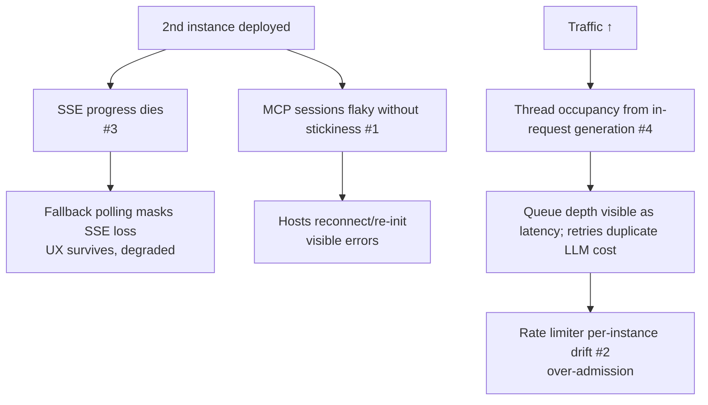
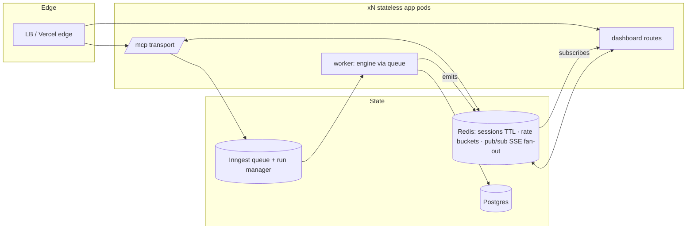

# 09 — Scaling Limits & Roadmap

> Part of the [architecture deep dive](./README.md). What genuinely breaks
> beyond one process, in what order, and the concrete migration plan. Written
> to be honest in an interview: "here's where it hurts, here's the fix, here's
> why it wasn't fixed yet."

---

## 1. The single-process inventory

Everything below is *correct today* (single instance, single region) and
*load-bearing*:

| # | Component | File | State held | Failure mode at N instances |
|---|---|---|---|---|
| 1 | MCP sessions | `transport/http.ts:39` Map | server+transport per session id | "Invalid or expired session" on non-sticky follow-ups; no TTL sweeper → slow leak in long-lived processes |
| 2 | Rate limiter buckets | `middleware/rate-limiter.ts:10` Map | windows + concurrency gauges | limits become per-instance (N× effective), reset on deploy |
| 3 | SSE emitter | `lib/streaming/EventEmitter.ts` global | listeners + replay history + seq counters | dashboard progress streams silently dead when subscribe lands on a different instance than emit |
| 4 | Generation execution | `agentic-workflow-v2` inside request/server action | request thread for ≤150 LLM steps | thread pool starvation under concurrency; LB idle timeouts; retry = duplicate LLM spend |
| 5 | Focused QA gates | local scripts | none | fine — but only run if humans remember (CI gap, Phase B1) |

What does **not** break: tools/resources are stateless per call; Postgres is
the system of record; widgets are static artifacts; OAuth tokens live in DB.
The architecture deliberately concentrated statefulness into four swappable
modules.

## 2. Load-order of pain (what breaks first)

Note the designed-in mercy: D2's fallback polling means #3 degrades UX rather
than killing it — that was a conscious resilience dividend.

## 3. Target topology (Phase C end-state)

## 4. Migration steps, sequenced by ROI

| Step | Work | Unblocks | Est. |
|---|---|---|---|
| C-a | CI first (`mcp:phase7` + typecheck + build on PR) — protect every refactor below | everything | 0.5 d |
| C-b | Session store behind interface → Redis w/ TTL sweeper (keep in-memory impl for tests) | multi-instance `/mcp`; kills leak | 2–3 d |
| C-c | Rate limiter → Redis sliding window (same module API) | correct global limits | 1 d |
| C-d | Emitter interface → Redis pub/sub adapter (+ history table or Redis stream for replay) | dashboard SSE across instances; MCP stays poll-based regardless | 2–3 d |
| C-e | Generation → Inngest worker (tool enqueues, RUNNING immediately; identical DB/SSE writes) | thread freedom, retries with dedup, future cancellation support | 3 d |
| C-f | Refresh rotation transactionalization + reuse detection (auth correctness, not scale — bundled here because same hardening pass) | token-family security | 1 d |

Sequencing rationale: **C-a before all** (every step touches hot paths);
**C-b/c before C-d** (they're simpler and independently deployable);
**C-e last** among infra (largest blast radius; its RUNNING/poll contract
means zero client changes).

## 5. Capacity math to quote in interviews

- Widget resources are immutable strings: CDN-cacheable, effectively free after first fetch per host.
- Per tool call: ~1 auth lookup (collapses to 0 post-C7) + 1 ownership query + payload build — DB-bound, index-friendly (`[userId, createdAt]`, prefix lookup on key hashes).
- Generation cost dominates: one run ≈ 8 nodes × provider latency (10–40 s total). Threads, not CPU, are the constrained resource → queueing is the fix, not more boxes.
- Sessions: each holds an SDK server+transport pair (~tens of KB); leak rate = abandoned hosts; TTL sweeper is ~20 lines even pre-Redis.

## 6. Explicitly deferred (and why that's defensible)

| Deferred item | Reasoning |
|---|---|
| Multi-region | product audience single-region; state externalization precedes this anyway |
| Read replicas | write-heavy during generation bursts; reads trivial until dashboards aggregate |
| gRPC/queue for tools | MCP protocol *is* the integration contract; adding another IDL buys nothing |
| Cancel-generation tool | backend lacks cancellation (Inngest limitation documented); shipping a fake would lie — revisit after C-e lands real run management |

Continue to [10 — Interview playbook](./10-interview-playbook.md).
