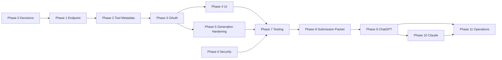

# Phase-Wise Implementation Plan: Verto AI MCP Apps

Last updated: 2026-06-17

Status: review draft. Do not implement until this plan is approved.

> **Historical document (2026-06).** This is the original phase-by-phase log
> that built the MCP server and its first widget layer. The widget layer has
> since been migrated to the standardized MCP Apps SDK
> (`@modelcontextprotocol/ext-apps`) — references to OpenAI-specific metadata
> (`openai/outputTemplate`, `window.openai`, dual metadata) describe the
> *former* implementation. See [`03-migration-plan.md`](./03-migration-plan.md)
> for the current design.

## 1. Goal

Turn the existing Verto AI MCP server into a public, review-ready app for:

- ChatGPT Apps / Connectors
- Claude Connectors Directory
- MCP Apps-compatible clients

The final user experience should be simple:

1. User finds Verto AI inside ChatGPT or Claude.
2. User clicks Connect.
3. User signs in to Verto and grants permission.
4. User asks the assistant to create, edit, preview, or publish presentations.
5. ChatGPT/Claude calls Verto MCP tools safely.
6. Verto returns useful text, structured data, and interactive UI where supported.

## 2. Current Starting Point

Already available in the repo:

| Area | Current implementation |
| --- | --- |
| MCP HTTP route | `src/app/api/mcp/route.ts` |
| Streamable HTTP transport | `src/mcp/transport/http.ts` |
| Local stdio transport | `src/mcp/transport/stdio.ts` |
| MCP server factory | `src/mcp/server.ts` |
| Tool registry | `src/mcp/tools/registry.ts` |
| Presentation tools | `src/mcp/tools/presentation/index.ts` |
| Resource registry | `src/mcp/resources/registry.ts` |
| API key auth | `src/mcp/auth/api-key.ts` |
| MCP API key UI/actions | `src/actions/mcp-keys.ts` |
| Protected resource rewrite | `src/proxy.ts` |
| Existing MCP docs | `docs/mcp/04-usage-guide.md` |

Main launch blockers:

| Blocker | Why it blocks public launch |
| --- | --- |
| No complete OAuth 2.1 flow | Public ChatGPT/Claude distribution should use account linking, not copied API keys. |
| Missing tool annotations | ChatGPT/Claude review requires tools to declare read/write/destructive behavior. |
| No MCP Apps UI resources | Users can call tools, but the app does not yet feel like an in-chat app. |
| No clean `/mcp` endpoint | Public app stores should use a clean stable URL such as `https://verto.ai.aditya-deokar.me/mcp`. |
| Submission packet not final | Directory review needs metadata, screenshots, test prompts, privacy/support links, and test accounts. |

## 3. Implementation Strategy

Build from lowest-risk infrastructure to highest-risk public launch:

1. Stabilize endpoint and protocol basics.
2. Add review-required metadata and annotations.
3. Add OAuth account linking.
4. Add interactive MCP Apps UI.
5. Harden long-running generation and errors.
6. Validate with real clients.
7. Prepare submission assets.
8. Submit to ChatGPT and Claude.

This order avoids building polished UI before the server can pass basic app review.

## 4. Phase 0: Planning Lock And Decisions

Purpose: settle product and technical choices before code changes.

### Locked Decisions

- [x] Final public domain:
  - Use `https://verto.ai.aditya-deokar.me`.
- [x] Public MCP URL:
  - Use `https://verto.ai.aditya-deokar.me/mcp`.
  - Keep existing `/api/mcp` for backward compatibility.
- [x] First release scope:
  - Include presentation tools.
  - Exclude billing, mobile design, admin template management, and user AI key management.
- [x] OAuth provider approach:
  - Choose Option C: build a small first-party OAuth server backed by Clerk login.
- [x] First release includes MCP Apps UI:
  - Build generation progress and deck preview.
- [x] Submission order:
  - Submit to ChatGPT first.
  - Submit to Claude after ChatGPT approval.
- [x] ChatGPT/Claude plan limit:
  - Allow 15 presentation generations for connected ChatGPT/Claude usage.
  - Enforce this through the Verto usage-limit layer during the implementation phase.
- [x] Reviewer test account:
  - Use `adityadeokar80@gmail.com`.

### OAuth Recommendation

Use Option C for this project.

Why:

- The repo already uses Clerk for sign-in and maps Clerk users into the Verto database.
- The existing MCP code already resolves authenticated users into `AuthContext`, so a first-party OAuth token can map cleanly to the same user model.
- ChatGPT and Claude need MCP-specific OAuth behavior: protected resource metadata, authorization server metadata, PKCE, resource/audience binding, Verto-specific scopes, consent, token refresh, and proper `WWW-Authenticate` challenges.
- Clerk remains valuable as the identity/login layer, but we should not depend on Clerk alone to be the MCP authorization server unless we verify it supports every MCP-specific requirement.
- An external provider would add a second identity system and more migration work for the current app.

Recommended shape:

- Clerk handles user login and session during `/oauth/authorize`.
- Verto owns MCP OAuth consent, scopes, auth codes, access tokens, refresh tokens, and revocation.
- Verto validates MCP bearer tokens in `src/mcp/auth/middleware.ts`.
- Existing Verto API keys remain for local stdio and developer/custom testing.

Option A fallback:

- Use Auth0, WorkOS, Okta, Cognito, or similar only if implementing a first-party OAuth layer becomes too slow or too risky.

Option B fallback:

- Use pure Clerk-as-OAuth-server only if a proof of concept confirms Clerk supports the MCP-required authorization server metadata, client handling, PKCE, resource parameter, custom scopes, and access-token audience validation needed by ChatGPT and Claude.

### Deliverables

- Approved domain and endpoint.
- Approved OAuth strategy.
- Approved v1 tool scope.
- Approved launch checklist.

### Exit Gate

No engineering starts until these decisions are accepted.

## 5. Phase 1: Public Endpoint And Discovery Foundation

Purpose: make Verto look like a production remote MCP server.

### Tasks

- [x] Add a clean public MCP route:
  - File: `src/app/mcp/route.ts`
  - Reuse handlers from `src/mcp/transport/http.ts`.
- [x] Keep existing `/api/mcp` working.
- [x] Update docs and helper constants to prefer `/mcp`.
- [x] Align shared helper fallback/docs to the production domain. Deployment env vars still need to be set in the hosting platform.
- [x] Expand protected resource metadata:
  - File: `src/app/api/mcp/oauth-protected-resource/route.ts`
  - Include `resource`.
  - Include `authorization_servers`.
  - Include supported bearer methods.
  - Include scopes if available.
  - Include docs URL.
- [x] Verify `src/proxy.ts` still rewrites `/.well-known/oauth-protected-resource` correctly.
- [x] Add or document `/.well-known/oauth-protected-resource/mcp` behavior if needed by clients.

### Acceptance Criteria

- `GET /mcp` returns server metadata or a valid MCP response.
- `POST /mcp` supports the same Streamable HTTP flow as `/api/mcp`.
- `/.well-known/oauth-protected-resource` returns valid protected resource metadata.
- Existing `/api/mcp` clients are not broken.

### Validation

- [ ] Manual browser/curl check for `/mcp`.
- [ ] Manual browser/curl check for well-known metadata.
- [ ] MCP Inspector can initialize against `/mcp`.

### Risks

| Risk | Mitigation |
| --- | --- |
| Route alias breaks Next.js route handling | Call shared `handlePost`, `handleGet`, `handleDelete`, and `handleOptions` directly instead of re-exporting route functions. |
| Existing clients use `/api/mcp` | Keep `/api/mcp` stable. |

## 6. Phase 2: Tool Metadata, Annotations, And Review Readiness

Purpose: make the existing tool list acceptable for ChatGPT and Claude review.

### Tasks

- [x] Add `title` to every presentation tool.
- [x] Add tool annotations to every presentation tool.
- [x] Review output schema / structured output. Existing JSON text responses stay for backward compatibility; compact output schemas are deferred until tool-by-tool payload design.
- [x] Review tool descriptions for prompt-injection patterns.
- [x] Ensure read and write tools stay separate.
- [x] Ensure destructive tool is isolated:
  - `presentation_delete_permanently`
  - Requires `confirm: true`
  - Marked `destructiveHint: true`
- [x] Check tool names are short enough for Claude review.
- [x] Add a tool metadata table in docs for maintainers: `docs/mcp-apps/05-tool-review-matrix.md`.

### Required Annotation Matrix

| Tool | Read-only | Destructive | Notes |
| --- | --- | --- | --- |
| `presentation_list` | yes | no | Metadata only by default. |
| `presentation_get` | yes | no | Can include slide JSON. |
| `presentation_create` | no | no | Creates a new deck. |
| `presentation_generate` | no | no | Creates a deck through AI generation. |
| `presentation_generation_status` | yes | no | Checks a tracked generation run without starting a duplicate generation. |
| `presentation_update_slides` | no | no | Replaces all slides, but not destructive deletion. |
| `presentation_update_theme` | no | no | Changes presentation appearance. |
| `presentation_publish` | no | no | Creates public share URL. |
| `presentation_unpublish` | no | no | Revokes public share URL. |
| `presentation_delete` | no | no | Soft delete only. |
| `presentation_recover` | no | no | Restores soft-deleted deck. |
| `presentation_delete_permanently` | no | yes | Irreversible delete. |

### Acceptance Criteria

- Tool list includes titles and annotations.
- Claude review checklist has no obvious tool metadata failures.
- ChatGPT connector creation shows clear tool descriptions.
- Invalid tool input returns actionable errors.

### Validation

- [ ] MCP Inspector `tools/list`.
- [ ] MCP Inspector call for every tool using a test account.
- [ ] Manual review of tool descriptions against prompt-injection rejection patterns.

### Risks

| Risk | Mitigation |
| --- | --- |
| Current SDK overload does not support annotations cleanly | Resolved by using the SDK's `registerTool` config API with `title`, `description`, `inputSchema`, and `annotations`. |
| Tool responses are only JSON strings | Add `structuredContent` gradually while keeping text fallback. |

## 7. Phase 3: OAuth 2.1 Account Linking

Purpose: replace API-key copy/paste with real "Connect Verto AI" account linking.

### Tasks

- [x] Finalize OAuth provider strategy from Phase 0.
- [x] Implement or configure authorization server metadata:
  - `/.well-known/oauth-authorization-server`
  - Optional: `/.well-known/openid-configuration`
- [x] Implement authorization endpoint:
  - `/oauth/authorize`
  - Handles login, consent, scopes, redirect URI validation, state, PKCE.
- [x] Implement token endpoint:
  - `/oauth/token`
  - Exchanges authorization code for access token and refresh token.
- [x] Implement JWKS endpoint if JWT access tokens are used:
  - `/oauth/jwks.json`
  - Not required for v1 because Phase 3 uses opaque access tokens stored as SHA-256 hashes instead of JWTs.
- [x] Implement token validation for MCP requests.
- [x] Add scope checks inside MCP auth context.
- [x] Keep existing API key validation for:
  - local stdio
  - MCP Inspector during early development
  - custom clients that cannot use OAuth
- [x] Add disconnect/revoke support:
  - `/oauth/revoke` or equivalent account disconnect path.
- [x] Add database models if self-issuing auth codes/refresh tokens.

### Implementation Notes

- Verto now uses a first-party OAuth authorization server backed by Clerk login.
- Access tokens and refresh tokens are opaque random values; only SHA-256 hashes are stored.
- Dynamic Client Registration is available at `/oauth/register`.
- Client ID Metadata Documents are supported for clients that use a URL as `client_id`.
- OAuth bearer validation runs before legacy MCP API-key validation.
- Existing API keys and Clerk-session access remain available for local and custom-client usage.
- OAuth-connected generation uses the approved 15-generation launch allowance.

### Suggested Scopes

```text
presentations:read
presentations:write
presentations:generate
presentations:publish
```

### Acceptance Criteria

- ChatGPT can start OAuth from connector setup.
- Claude can start OAuth from custom connector setup.
- User can sign in to Verto and consent.
- Host receives token and can call `/mcp`.
- Access token maps to the correct Verto user.
- Token audience/resource is enforced.
- Insufficient scope returns HTTP 403 with useful auth challenge.
- Invalid token returns HTTP 401 with useful auth challenge.

### Validation

- [ ] OAuth happy path in browser.
- [ ] OAuth invalid redirect URI test.
- [ ] OAuth expired code test.
- [ ] OAuth wrong resource/audience test.
- [ ] OAuth insufficient scope test.
- [ ] MCP Inspector with OAuth token.
- [ ] ChatGPT developer mode OAuth.
- [ ] Claude custom connector OAuth.

### Risks

| Risk | Mitigation |
| --- | --- |
| OAuth takes longer than expected | Prefer an established IdP if compatible with MCP requirements. |
| Clerk cannot satisfy MCP OAuth directly | Use Clerk for login only and issue MCP OAuth tokens from a first-party authorization layer. |
| Token validation becomes too complex | Start with JWT access tokens plus hashed refresh tokens, then add hardening. |

## 8. Phase 4: MCP Apps UI Foundation

Purpose: make Verto feel like an app inside ChatGPT and Claude, not just a backend tool list.

### Tasks

- [x] Add UI build setup.
  - Started with static self-contained HTML widget resources under `src/mcp/apps`.
  - Vite/single-file bundling remains a later enhancement if the widgets grow.
- [x] Add `@modelcontextprotocol/ext-apps` if needed.
  - Not needed for the current static resource foundation.
- [ ] Add Vite single-file widget build if not already available.
- [x] Create UI folder structure:

```text
src/mcp/apps/
  constants.ts
  widgets.ts
```

- [x] Create generated UI output folder:

```text
No generated folder yet. Static v1 widgets are emitted from TypeScript HTML helpers.
```

- [x] Register MCP Apps resources:
  - `ui://verto/generation-progress.html`
  - `ui://verto/deck-preview.html`
- [x] Attach UI metadata to relevant tools.
- [x] Add strict UI CSP metadata.
- [x] Ensure every UI-enabled tool still returns text fallback.

### Implementation Notes

- `presentation_generate` advertises `ui://verto/generation-progress.html`.
- `presentation_get` advertises `ui://verto/deck-preview.html`.
- The descriptors include both portable UI metadata and OpenAI-compatible `openai/outputTemplate`.
- Widgets are self-contained HTML/CSS/JS and do not receive tokens or secrets.
- Existing JSON text responses remain the fallback for hosts without UI support.

### UI 1: Generation Progress

Used by:

- `presentation_generate`

Shows:

- Topic/title.
- Run status.
- Current step name.
- Progress percentage.
- Success/failure state.
- Link or action to open completed deck.

### UI 2: Deck Preview

Used by:

- `presentation_get`
- completed `presentation_generate`

Shows:

- Presentation title.
- Theme.
- Slide count.
- Thumbnail/list preview.
- Publish status.
- Open in Verto action.

### Acceptance Criteria

- UI resources are listed/fetchable by MCP host.
- UI renders in ChatGPT.
- UI renders in Claude.
- UI works without secrets in props.
- UI has useful text fallback.

### Validation

- [ ] MCP Inspector resource fetch if supported.
- [ ] ChatGPT developer mode rendering.
- [ ] Claude custom connector rendering.
- [ ] Browser console has no blocked CSP errors.
- [ ] Mobile-ish narrow layout remains usable.

### Risks

| Risk | Mitigation |
| --- | --- |
| Host support differs between ChatGPT and Claude | Use MCP Apps standard first; feature-detect ChatGPT-only APIs. |
| UI leaks sensitive data | Only pass minimum structured data; never pass tokens or secrets. |
| CSP blocks assets | Prefer single-file bundled widgets for v1. |

## 9. Phase 5: Long-Running Generation Hardening

Purpose: make `presentation_generate` reliable inside hosted AI clients.

### Tasks

- [x] Review current `presentation_generate` timeout behavior.
- [x] Ensure generation creates a durable run ID immediately.
- [x] Return `RUNNING` plus `progress_resource_uri` before host timeout.
- [x] Ensure progress resource works for the authenticated user only.
- [x] Add clearer errors for generation failure.
- [x] Add telemetry:
  - run started
  - run completed
  - run failed
  - timeout returned as running
- [x] Confirm free/pro usage limits are enforced consistently.

### Implementation Notes

- `presentation_generate` now creates a generation run immediately and marks it `RUNNING` before the pipeline starts.
- The default MCP wait timeout is `25_000` ms, with an explicit max of `120_000` ms.
- If the run is still active at the wait timeout, the tool returns `RUNNING`, `generation_run_id`, `progress_resource_uri`, and next actions.
- `presentation_generation_status` lets ChatGPT/Claude check progress in follow-up turns without starting duplicate generations.
- The progress resource returns the same shared status payload as the status tool.
- Generation telemetry logs `run_created`, `run_started`, `run_completed`, `run_failed`, `timeout_returned_running`, and `status_read`.
- OAuth-connected generation still uses the approved 15-generation launch allowance.

### Acceptance Criteria

- Short generation can complete in the first tool response.
- Long generation returns a running status instead of timing out.
- User can ask follow-up status questions.
- UI progress resource can display status.
- Failed generation gives an actionable error.

### Validation

- [ ] Fast generation test.
- [ ] Forced slow generation test.
- [ ] Failed generation test.
- [ ] Unauthorized progress resource test.
- [ ] Tool output size test.

### Risks

| Risk | Mitigation |
| --- | --- |
| Hosted clients time out | Return early with progress resource. |
| User loses track of run | Return run ID, progress URI, and deck ID once available. |

## 10. Phase 6: Security, Privacy, And Observability Hardening

Purpose: pass app review and avoid dangerous production behavior.

### Tasks

- [x] Add or verify ownership checks on every read/write.
- [x] Add scope checks per tool.
- [x] Add rate limit headers or documented rate limit errors where practical.
- [x] Review logging for PII and secrets.
- [x] Add audit records for write/destructive tools.
- [x] Ensure permanent delete is impossible without explicit confirmation.
- [x] Add prompt-injection test cases.
- [x] Add output-size guardrails for slide-heavy responses.
- [x] Add production health check behavior.

### Implementation Notes

- Tool ownership behavior is documented in `docs/mcp-apps/06-security-privacy-observability.md`.
- Tool audit logs now include operation type, auth method, scope count, destructive/public-share flags, latency, and response size.
- Audit logs redact secrets and high-risk user-content fields.
- Generation telemetry redacts topic text and records only operational generation fields.
- `presentation_get`, `presentation_update_slides`, and completed generation responses cap slide payloads and report truncation metadata.
- `GET /mcp` advertises health, rate-limit, output-limit, and privacy metadata.
- `/mcp/health` and `/api/mcp/health` return production health status.
- Rate-limit tool errors include retry timing and limit metadata.
- Prompt-injection tests are captured in `docs/mcp-apps/06-security-privacy-observability.md`.

### Acceptance Criteria

- No tool can access another user's data.
- No token/API key appears in logs or tool responses.
- Write tools log auditable events.
- Invalid inputs return specific, helpful errors.
- Prompt-injection tests do not cause unsafe actions.

### Validation

- [ ] Cross-user access test.
- [ ] Revoked token/key test.
- [ ] Rate limit test.
- [ ] Permanent delete confirmation test.
- [ ] Prompt-injection test prompt suite.

## 11. Phase 7: Automated And Manual Testing

Purpose: prove the integration works before app-store submission.

### Tasks

- [x] Add automated tests for auth helpers and scope checks.
- [x] Add automated tests for tool metadata/annotations.
- [x] Add automated integration checks for key MCP flows that can run without live host credentials.
- [x] Document reviewer test account setup with real sample deck requirements.
- [ ] Populate the reviewer test account with real sample decks.
- [ ] Run MCP Inspector against `/mcp`.
- [ ] Run ChatGPT developer mode test.
- [ ] Run Claude custom connector test.
- [x] Document all test prompts and expected behavior.

### Implementation Notes

- Added `npm run mcp:phase7:checks` for repo-native MCP contract checks.
- Added `npm run mcp:phase7:typecheck` for focused TypeScript validation over MCP, OAuth, resources, UI, and app-hosting routes.
- Added `npm run mcp:phase7` to run both checks.
- Added `docs/mcp-apps/07-testing-plan.md` with manual MCP Inspector, ChatGPT developer mode, Claude custom connector, OAuth, safety, reviewer account, and evidence-capture steps.
- Live-client validation remains open until it is run against the deployed production URL with `adityadeokar80@gmail.com`.

### Test Prompt Set

```text
List my Verto presentations.
Show me the newest presentation.
Create a 5 slide deck outline for an AI note-taking app.
Generate a 7 slide investor pitch deck for a privacy-first analytics startup.
Show me the generation progress.
Show me a preview of this deck.
Change the deck theme to a clean startup style.
Publish this deck and give me the share link.
Unpublish the deck I just published.
Soft-delete the test deck.
Recover the test deck.
Permanently delete the test deck only after I explicitly confirm.
```

### Acceptance Criteria

- MCP Inspector passes all required flows.
- ChatGPT developer mode can connect and call tools.
- Claude custom connector can connect and call tools.
- UI renders in both hosts or gracefully falls back.
- Test account instructions are clear enough for an external reviewer.

## 12. Phase 8: Product Submission Packet

Purpose: prepare everything reviewers and users will see.

### Tasks

- [x] Finalize app name:
  - `Verto AI`
- [x] Finalize tagline:
  - `Create and edit AI presentations from chat`
- [x] Finalize short description.
- [x] Finalize long description.
- [x] Prepare logo/icon requirements and export checklist.
- [x] Prepare 3-5 screenshots plan:
  - generation prompt result
  - progress UI
  - deck preview UI
  - publish/share result
  - optional theme edit result
- [x] Prepare docs page drafts:
  - "Connect Verto AI to ChatGPT"
  - "Connect Verto AI to Claude"
- [ ] Publish docs pages on the Verto website.
- [ ] Export final owned logo/icon assets.
- [ ] Capture final screenshots from ChatGPT developer mode and Claude custom connector.
- [ ] Publish privacy policy and terms links.
- [ ] Prepare support contact.
- [ ] Populate reviewer test account.
- [x] Prepare reviewer instructions.
- [x] Prepare data handling answers.
- [x] Prepare policy/compliance answers.

### Implementation Notes

- Added `docs/mcp-apps/08-product-submission-packet.md` as the copy-paste source for ChatGPT and Claude submission fields.
- Added `docs/mcp-apps/submission-assets/README.md` with screenshot/icon/evidence naming conventions.
- The packet includes listing copy, OAuth details, tool summary, reviewer prompts, reviewer instructions, data handling answers, compliance answers, public help article drafts, and owner submission steps.
- External owner tasks remain open because they require production access or business decisions: final owned logo export, screenshot capture, privacy/terms/support URLs, published help pages, and populated reviewer account.

### Acceptance Criteria

- ChatGPT submission form can be completed without searching for missing info.
- Claude submission form can be completed without searching for missing info.
- Reviewer credentials and steps work from a clean browser.

## 13. Phase 9: ChatGPT Submission

Purpose: submit Verto AI to ChatGPT public distribution.

### Tasks

- [ ] Ensure OpenAI organization/business verification is complete.
- [ ] Use an eligible OpenAI project for app submission.
- [ ] Create/test connector in developer mode.
- [ ] Add MCP server URL and OAuth credentials/details.
- [x] Generate automated MCP Apps visual QA evidence with `npm run mcp:phase9h`.
- [ ] Add app metadata, screenshots, privacy policy, support link, and test prompts.
- [ ] Complete compliance confirmations.
- [ ] Submit for review.
- [ ] Track status and reviewer feedback.
- [ ] Fix issues and resubmit if needed.
- [ ] Publish once approved.

### Acceptance Criteria

- Verto AI is approved and available through ChatGPT's app/connectors discovery path.
- Users can connect through OAuth and use tools in a conversation.

## 14. Phase 10: Claude Directory Submission

Purpose: submit Verto AI to the Claude Connectors Directory after ChatGPT approval.

### Tasks

- [ ] Confirm ChatGPT approval and publication status from Phase 9.
- [ ] Confirm Claude Team/Enterprise submission access or use Anthropic form path.
- [ ] Add Verto as a custom connector and verify runtime behavior.
- [ ] Submit remote MCP server through the directory portal.
- [ ] Provide MCP Apps screenshots if UI is included.
- [ ] Complete listing, use cases, company, auth, data handling, test, and compliance steps.
- [ ] Fix missing tool annotation warnings if portal reports them.
- [ ] Submit for review.
- [ ] Track dashboard feedback.
- [ ] Publish once approved.

### Acceptance Criteria

- Verto AI appears in Claude Connectors Directory.
- Users can connect through OAuth and use Verto tools in Claude.

## 15. Phase 11: Post-Launch Operations

Purpose: keep the app healthy after users start connecting.

### Tasks

- [ ] Add dashboard metrics:
  - connection attempts
  - OAuth failures
  - tool calls by tool name
  - tool success/failure rate
  - p50/p95 latency
  - generation completion rate
  - active connected users
- [ ] Add alerting for:
  - MCP endpoint failure
  - OAuth failure spike
  - high 5xx rate
  - generation failure spike
- [ ] Add support runbook.
- [ ] Add rollback plan.
- [ ] Add docs for disconnecting Verto from ChatGPT/Claude.
- [ ] Schedule periodic review of tool descriptions and app policies.

### Acceptance Criteria

- Team can detect and debug production issues quickly.
- Users can self-serve common setup problems.
- App remains compliant as platform policies evolve.

## 16. Recommended Work Breakdown

### Milestone A: Private Developer-Ready MCP Server

Includes:

- Phase 1
- Phase 2
- Basic Phase 6 checks

Outcome:

- Verto MCP endpoint is cleaner and review-grade at the tool metadata level.

### Milestone B: Private OAuth-Connected App

Includes:

- Phase 3
- Phase 7 OAuth validation

Outcome:

- ChatGPT developer mode and Claude custom connector can connect through OAuth.

### Milestone C: Interactive App Experience

Includes:

- Phase 4
- Phase 5
- Phase 7 UI validation

Outcome:

- Generation progress and deck preview render inside supported hosts.

### Milestone D: Public Submission

Includes:

- Phase 8
- Phase 9
- Phase 10

Outcome:

- Verto AI is approved in ChatGPT first, then submitted to Claude.

### Milestone E: Production Operations

Includes:

- Phase 11

Outcome:

- App is monitored, supportable, and ready for real users.

## 17. Dependency Order



## 18. First Implementation Sprint Recommendation

When this plan is approved, start with Milestone A only.

Sprint 1 tasks:

1. Add `/mcp` route alias.
2. Update constants/docs to prefer `/mcp`.
3. Expand protected resource metadata shape.
4. Add tool titles and annotations.
5. Validate `tools/list` through MCP Inspector.
6. Document any SDK limitations found while adding annotations.

Why start here:

- It is low risk.
- It does not require OAuth design decisions to be perfect yet.
- It immediately reduces app review risk.
- It gives us a cleaner base for ChatGPT/Claude testing.

## 19. Resolved Release Decisions

All previously open release questions are now answered:

| Question | Decision |
| --- | --- |
| Claude submission timing | Submit Claude after ChatGPT approval. |
| ChatGPT/Claude usage limit | 15 presentation generations for connected ChatGPT/Claude usage. |
| Reviewer test account | `adityadeokar80@gmail.com` |

## 20. Definition Of Ready To Implement

We are ready to begin coding when:

- This plan is reviewed and approved.
- Phase 0 locked decisions are accepted.
- The first implementation milestone is selected.
- Any domain/OAuth provider credentials needed for the chosen milestone are available.
- The reviewer test account is populated with safe sample presentations before submission.
